*B3226										07/03/2016*

*B3234*

*B3221*

Compte rendu TP Bases de Données Distribuées

Fragmentation d’une base existante

(approche top-down)

SOMMAIRE :

[[TOC]]

# I. Rappel rapide du contexte et des objectifs du TP.

	Dans ce TP, nous simulerons la fragmentation d’une base de données d’une entreprise implémentée en Europe du Nord, en Europe du Sud, ainsi qu’en Amérique. Il n’est pas exclus qu’elle puisse se développer ailleurs par la suite. Le siège de l’entreprise est en Europe du Nord.

	Nous devons ainsi réaliser la fragmentation d’une base de données Oracle sur trois sites géographiquement distants, afin d’optimiser au mieux les performances des requêtes y étant effectuées, selon les applications utilisées sur chaque site, de manière à ce que la répartition soit transparente pour l’utilisateur final.

# II. Présentation du groupe de travail et des rôles de chacun

## A. Groupe de binôme avec numéros des binômes, noms de chacun. 

<table>
  <tr>
    <td>Numéro de binôme</td>
    <td>Membre 1</td>
    <td>Membre 2</td>
  </tr>
  <tr>
    <td>B3221</td>
    <td>BRUNET Devon</td>
    <td>KIENLEN Nathan</td>
  </tr>
  <tr>
    <td>B3226</td>
    <td>SAMBORSKI Charles</td>
    <td>SULTAN Arthur</td>
  </tr>
  <tr>
    <td>B3234</td>
    <td>ROBION François</td>
    <td>BLANC Alexandra (Absente)</td>
  </tr>
</table>

## B. Identification des tâches à réaliser et répartition

	Les responsabilités et tâches peuvent être résumées dans le tableau suivant :

<table>
  <tr>
    <td>Nom / Binôme</td>
    <td>Rôle</td>
  </tr>
  <tr>
    <td>Responsable projet</td>
    <td>SULTAN Arthur</td>
  </tr>
  <tr>
    <td>Responsable compte-rendu</td>
    <td>KIENLEN Nathan</td>
  </tr>
  <tr>
    <td>B3221</td>
    <td>Europe du Sud</td>
  </tr>
  <tr>
    <td>B3226</td>
    <td>Europe du Nord</td>
  </tr>
  <tr>
    <td>B3234</td>
    <td>Amérique</td>
  </tr>
</table>

# 
III. Fragmentation

## A. Détermination des fragments

### 
1. Fragmentation horizontale

#### i) Table Client

Dans le sujet, on nous indique que chaque site accède uniquement aux clients locaux.

100% des requêtes d’un site sur la table Client concernera donc les clients de son site.

Dans les requêtes, on retrouve la condition « Client.Pays IN ‘EuropeNord’ » ou  « Client.Pays IN ‘EuropeSud’ »  ou encore « Client.Pays IN ‘Amerique’».

L’ensemble des prédicats simples pour les clients, d’après les informations à notre disposition, est donc:  « Pays IN ‘EuropeNord’ »; «Pays IN ‘EuropeSud’ »; «Pays IN ‘Amerique’».

Un tuple est nécessairement qualifié par une des combinaisons possibles de ces prédicats simples. On obtient donc les prédicats composés suivants :

* Pays est dans ‘EuropeNord’ et Pays n’est pas dans ‘EuropeSud’ et Pays n’est pas dans ‘Amerique’

* Pays n’est pas dans ‘EuropeNord’ et Pays est dans ‘EuropeSud’ et Pays n’est pas dans ‘Amerique’

* Pays n’est pas dans ‘EuropeNord’ et Pays n’est pas dans ‘EuropeSud’ etPays est dans ‘Amerique’

* Pays n’est pas dans ‘EuropeNord’ et Pays n’est pas dans ‘EuropeSud’ et Pays n’est pas dans ‘Amerique’.

* Pays n’est pas dans ‘EuropeNord’ et Pays est dans ‘EuropeSud’ et Pays est dans ‘Amerique’

* Pays est dans ‘EuropeNord’ et Pays est dans ‘EuropeSud’ et Pays n’est pas dans ‘Amerique’

* Pays est dans ‘EuropeNord’ et Pays est dans ‘EuropeSud’ et Pays est dans ‘Amerique’

* Pays est dans ‘EuropeNord’ et Pays n’est pas dans ‘EuropeSud’ et Pays est dans ‘Amerique’.

Après simplification logique - un pays ne peut pas être ici dans deux sites à la fois - on obtient donc les prédicats suivants, qui caractérisent chacun des tuples de la table Client : 

« Le pays est en Europe du nord », « Le pays est en Europe du sud », « le pays est en Amérique » ou « le pays est dans une autre région ». 

#### ii) Table Stock

	Dans le sujet, on nous indique que les sites effectuent des accès très fréquents à leur stock local contre un accès peu fréquent aux autres stocks. On peut donc affirmer qu’une majorité des requêtes des stocks, pour chaque site, seront concentrées sur le stock local au site.

Par le même raisonnement que pour la table Client, on en déduit les prédicats suivants pour caractériser chacun des tuples de la table Stock:

« Le pays est en Europe du nord », « Le pays est en Europe du sud », « le pays est en Amérique » ou « le pays est dans une autre région ».

#### iii) Tables Commandes et DétailsCommandes

La table Commandes dépendant de Clients et la table DétailsCommandes dépendant de Commandes, on doit effectuer une fragmentation horizontale dérivée sur la table Commandes et sur la table DétailsCommandes.

Ces tables sont ainsi obtenues en effectuant les opérations suivantes:

Commandes_EuN = Commandes **⋉**[Code_Client] Clients_EuN

Commandes_EuS = Commandes **⋉**[Code_Client] Clients_EuS

Commandes_A = Commandes **⋉**[Code_Client] Clients_A

Commandes_Autres = Commandes **⋉**[Code_Client] Clients_Autres

Commandes_ClientInconnu = σ[Code_Client is null] (Commandes)

Details_Commandes_EuN= Details_Commandes **⋉**[No_Commande] Commandes_EuN

Details_Commandes_EuS= Details_Commandes **⋉**[No_Commande] Commandes_EuS

Details_Commandes_A= Details_Commandes **⋉**[No_Commande] Commandes_A

Details_Commandes_Autres= Details_Commandes **⋉**[No_Commande] Commandes_Autres

Details_Commandes_CommandeNull= σ[No_Commande is null] (Details_Commandes)

Les contraintes d’intégrité indiquées sur le schéma de la base - « Code_Client is not null » pour la table Commandes et « No_Commande is not null » - permettent d’éliminer la dernière semi-équi-jointure (évitant ainsi un fragment supplémentaire pour les Commandes et les Détails_Commandes). Encore une fois, un tuple de ces deux tables ne peut pas être géré par deux sites différents, correspondant à un seul Client, un seul Pays et donc un seul site (la fragmentation sur la table Client permet la mise en place de 4 fragments distincts, comme démontré auparavant).

### 2. Fragmentation Verticale et mixte

Pour ce sujet, nous n’avons pas effectué de fragmentation verticale (et à fortiori mixte). En effet, la fragmentation verticale sert essentiellement à masquer des informations à certains types d’utilisateurs, ce qui n’aurait pas eu d’intérêt ici, chaque site manipulant tout les attributs des tables auxquelles il a accès.

### 3. Bilan de la fragmentation

Le schéma suivant récapitule la fragmentation du schéma de la base, après étude du sujet et prise en compte des contraintes:

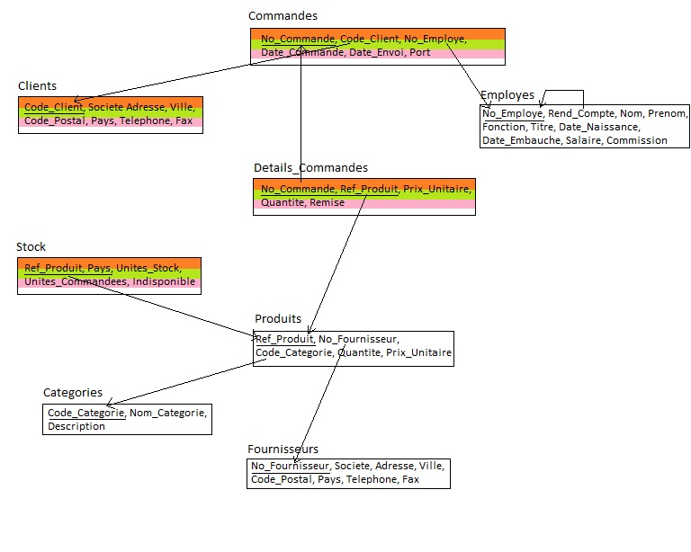

Remarque: Nous avons choisi, pour chacune des tables que nous avons fragmenté, de suffixer le nom originale de la table avec un code représentant la région gérée. Ainsi, _EuN représente l’Europe du nord, _EuS représente l’Europe du Sud, _A représente l’Amérique et _Autres représente les autres régions.

## 
B. Placement des fragments sur les sites (sans réplication)

### 1. Analyse

Il est dit que chaque site utilise en priorité les données de ses clients locaux.

De plus, de nouvelles contraintes ont été ajoutées avec les applications :

* MakeIt : sur le site du siège (Europe du Nord), utilise la table "FOURNISSEURS",

* DesignIt : sur le site Europe du Sud, modification exclusive de PRODUITS et CATEGORIES,

* SellIt : sur tous les sites, accès principalement au STOCK local, (aucune différentiation)

* RH : sur le site Américain, gestion de la table EMPLOYES,

Par ailleurs, les tables gérant les autres régions du monde sont stockées sur le site Europe du Nord.

Nous pouvons résumer la probabilité d’usage de chaque table selon chaque site dans un tableau à double entrée :

(avec ε1 et ε2 négligeables devant 1)

<table>
  <tr>
    <td>Tables</td>
    <td>Europe du Nord</td>
    <td>Europe du Sud</td>
    <td>Amerique</td>
  </tr>
  <tr>
    <td>CLIENTS_EuN</td>
    <td>1 - (ε1 + ε2)</td>
    <td>ε1</td>
    <td>ε2</td>
  </tr>
  <tr>
    <td>CLIENTS_EuS</td>
    <td>ε1</td>
    <td>1 - (ε1 + ε2)</td>
    <td>ε2</td>
  </tr>
  <tr>
    <td>CLIENTS_A</td>
    <td>ε1</td>
    <td>ε2</td>
    <td>1 - (ε1 + ε2)</td>
  </tr>
  <tr>
    <td>CLIENTS_Autres</td>
    <td>1 - (ε1 + ε2)</td>
    <td>ε1</td>
    <td>ε2</td>
  </tr>
  <tr>
    <td>COMMANDES_EuN</td>
    <td>1 - (ε1 + ε2)</td>
    <td>ε1</td>
    <td>ε2</td>
  </tr>
  <tr>
    <td>COMMANDES_EuS</td>
    <td>ε1</td>
    <td>1 - (ε1 + ε2)</td>
    <td>ε2</td>
  </tr>
  <tr>
    <td>COMMANDES_A</td>
    <td>ε1</td>
    <td>ε2</td>
    <td>1 - (ε1 + ε2)</td>
  </tr>
  <tr>
    <td>COMMANDES_Autres</td>
    <td>1 - (ε1 + ε2)</td>
    <td>ε1</td>
    <td>ε2</td>
  </tr>
  <tr>
    <td>DETAILS_COMMANDES_EuN</td>
    <td>1 - (ε1 + ε2)</td>
    <td>ε1</td>
    <td>ε2</td>
  </tr>
  <tr>
    <td>DETAILS_COMMANDES_EuS</td>
    <td>ε1</td>
    <td>1 - (ε1 + ε2)</td>
    <td>ε2</td>
  </tr>
  <tr>
    <td>DETAILS_COMMANDES_A</td>
    <td>ε1</td>
    <td>ε2</td>
    <td>1 - (ε1 + ε2)</td>
  </tr>
  <tr>
    <td>DETAILS_COMMANDES_Autres</td>
    <td>1 - (ε1 + ε2)</td>
    <td>ε1</td>
    <td>ε2</td>
  </tr>
  <tr>
    <td>STOCK_EuN</td>
    <td>1 - (ε1 + ε2)</td>
    <td>ε1</td>
    <td>ε2</td>
  </tr>
  <tr>
    <td>STOCK_EuS</td>
    <td>ε1</td>
    <td>1 - (ε1 + ε2)</td>
    <td>ε2</td>
  </tr>
  <tr>
    <td>STOCK_A</td>
    <td>ε1</td>
    <td>ε2</td>
    <td>1 - (ε1 + ε2)</td>
  </tr>
  <tr>
    <td>STOCK_Autres</td>
    <td>1 - (ε1 + ε2)</td>
    <td>ε1</td>
    <td>ε2</td>
  </tr>
  <tr>
    <td>EMPLOYES</td>
    <td>ε1</td>
    <td>ε2</td>
    <td>1 - (ε1 + ε2)</td>
  </tr>
  <tr>
    <td>PRODUITS</td>
    <td>ε1</td>
    <td>1 - (ε1 + ε2)</td>
    <td>ε2</td>
  </tr>
  <tr>
    <td>CATEGORIES</td>
    <td>ε1</td>
    <td>1 - (ε1 + ε2)</td>
    <td>ε2</td>
  </tr>
  <tr>
    <td>FOURNISSEURS</td>
    <td>1 - (ε1 + ε2)</td>
    <td>ε1</td>
    <td>ε2</td>
  </tr>
</table>

### 2. Bilan

Grâce à cette analyse préalable, nous avons ainsi décidé de répartir les fragments comme décrit dans le tableau suivant :

<table>
  <tr>
    <td>Tables</td>
    <td>Europe du Nord</td>
    <td>Europe du Sud</td>
    <td>Amerique</td>
  </tr>
  <tr>
    <td>CLIENTS_EuN</td>
    <td>X</td>
    <td></td>
    <td></td>
  </tr>
  <tr>
    <td>CLIENTS_EuS</td>
    <td></td>
    <td>X</td>
    <td></td>
  </tr>
  <tr>
    <td>CLIENTS_A</td>
    <td></td>
    <td></td>
    <td>X</td>
  </tr>
  <tr>
    <td>CLIENTS_Autres</td>
    <td>X</td>
    <td></td>
    <td></td>
  </tr>
  <tr>
    <td>COMMANDES_EuN</td>
    <td>X</td>
    <td></td>
    <td></td>
  </tr>
  <tr>
    <td>COMMANDES_EuS</td>
    <td></td>
    <td>X</td>
    <td></td>
  </tr>
  <tr>
    <td>COMMANDES_A</td>
    <td></td>
    <td></td>
    <td>X</td>
  </tr>
  <tr>
    <td>COMMANDES_Autres</td>
    <td>X</td>
    <td></td>
    <td></td>
  </tr>
  <tr>
    <td>DETAILS_COMMANDES_EuN</td>
    <td>X</td>
    <td></td>
    <td></td>
  </tr>
  <tr>
    <td>DETAILS_COMMANDES_EuS</td>
    <td></td>
    <td>X</td>
    <td></td>
  </tr>
  <tr>
    <td>DETAILS_COMMANDES_A</td>
    <td></td>
    <td></td>
    <td>X</td>
  </tr>
  <tr>
    <td>DETAILS_COMMANDES_Autres</td>
    <td>X</td>
    <td></td>
    <td></td>
  </tr>
  <tr>
    <td>STOCK_EuN</td>
    <td>X</td>
    <td></td>
    <td></td>
  </tr>
  <tr>
    <td>STOCK_EuS</td>
    <td></td>
    <td>X</td>
    <td></td>
  </tr>
  <tr>
    <td>STOCK_A</td>
    <td></td>
    <td></td>
    <td>X</td>
  </tr>
  <tr>
    <td>STOCK_Autres</td>
    <td>X</td>
    <td></td>
    <td></td>
  </tr>
  <tr>
    <td>EMPLOYES</td>
    <td></td>
    <td></td>
    <td>X</td>
  </tr>
  <tr>
    <td>PRODUITS</td>
    <td></td>
    <td>X</td>
    <td></td>
  </tr>
  <tr>
    <td>CATEGORIES</td>
    <td></td>
    <td>X</td>
    <td></td>
  </tr>
  <tr>
    <td>FOURNISSEURS</td>
    <td>X</td>
    <td></td>
    <td></td>
  </tr>
</table>

## C. Mise en oeuvre de la base sans réplication

Pour créer les tables, nous avons utilisé une table "Pays_Continent", associant à chaque pays géré par Ryori, un continent parmi Europe du nord, Europe du sud et Amérique. Un pays absent de cette table est considéré comme étant géré par le “site” Autres.

La répartition des pays par site est donnée ci-dessous:

*Europe du Nord :* Norvège, Suède, Danemark, Islande, Finlande, Royaume-Uni, Irlande, Belgique, Luxembourg, Pays-Bas, Allemagne, Pologne.

*Europe du Sud :* Espagne, Portugal, Andorre, France, Gibraltar, Italie, SaintMarin, Vatican, Malte, Albanie, Bosnie-Herzégovine, Croatie, Grèce, Macédoine, Monténégro, Serbie, Slovénie, Bulgarie, à laquelle nous avons ajouté les pays Autriche et Suisse.

*Amérique :* Antigua-et-Barbuda, Argentine, Bahamas, Barbade, Belize, Bolivie, Brésil, Canada, Chili, Colombie, Costa Rica, Cuba, République dominicaine, Dominique, Équateur, États-Unis, Grenade, Guatemala, Guyana, Haïti, Honduras, Jamaïque, Mexique, Nicaragua, Panama, Paraguay, Pérou, Saint-Christophe-et-Niévès, SainteLucie, Saint-Vincent-et-les Grenadines, Salvador, Suriname, Trinité-et-Tobago, Uruguay, Venezuela.

Le code SQL correspondant à la création de la table d’association décrite précédemment est donné ci-dessous :

CREATE TABLE PAYS_CONTINENTS(

  PAYS              VARCHAR2(15)  NOT NULL,

  CONTINENT         VARCHAR2(15)  NOT NULL

);

 

-- Insertion en Europe du nord

INSERT INTO PAYS_CONTINENTS(PAYS, CONTINENT) VALUES('Allemagne', 'EuN');

INSERT INTO PAYS_CONTINENTS(PAYS, CONTINENT) VALUES('Belgique', 'EuN');

INSERT INTO PAYS_CONTINENTS(PAYS, CONTINENT) VALUES('Danemark', 'EuN');

INSERT INTO PAYS_CONTINENTS(PAYS, CONTINENT) VALUES('Finlande', 'EuN');

INSERT INTO PAYS_CONTINENTS(PAYS, CONTINENT) VALUES('Irlande', 'EuN');

INSERT INTO PAYS_CONTINENTS(PAYS, CONTINENT) VALUES('Islande', 'EuN');

INSERT INTO PAYS_CONTINENTS(PAYS, CONTINENT) VALUES('Luxembourg', 'EuN');

INSERT INTO PAYS_CONTINENTS(PAYS, CONTINENT) VALUES('Norvege', 'EuN');

INSERT INTO PAYS_CONTINENTS(PAYS, CONTINENT) VALUES('Pays_Bas', 'EuN');

INSERT INTO PAYS_CONTINENTS(PAYS, CONTINENT) VALUES('Pologne', 'EuN');

INSERT INTO PAYS_CONTINENTS(PAYS, CONTINENT) VALUES('Royaume-Uni', 'EuN');

INSERT INTO PAYS_CONTINENTS(PAYS, CONTINENT) VALUES('Suede', 'EuN');

 

-- Insertion en Europe du sud

INSERT INTO PAYS_CONTINENTS(PAYS, CONTINENT) VALUES('Albanie', 'EuS');

INSERT INTO PAYS_CONTINENTS(PAYS, CONTINENT) VALUES('Andorre', 'EuS');

INSERT INTO PAYS_CONTINENTS(PAYS, CONTINENT) VALUES('Autriche', 'EuS');

INSERT INTO PAYS_CONTINENTS(PAYS, CONTINENT) VALUES('Bosnie-Herzegov', 'EuS');

INSERT INTO PAYS_CONTINENTS(PAYS, CONTINENT) VALUES('Bulgarie', 'EuS');

INSERT INTO PAYS_CONTINENTS(PAYS, CONTINENT) VALUES('Croatie', 'EuS');

INSERT INTO PAYS_CONTINENTS(PAYS, CONTINENT) VALUES('Espagne', 'EuS');

INSERT INTO PAYS_CONTINENTS(PAYS, CONTINENT) VALUES('France', 'EuS');

INSERT INTO PAYS_CONTINENTS(PAYS, CONTINENT) VALUES('Gibraltar', 'EuS');

INSERT INTO PAYS_CONTINENTS(PAYS, CONTINENT) VALUES('Grece', 'EuS');

INSERT INTO PAYS_CONTINENTS(PAYS, CONTINENT) VALUES('Italie', 'EuS');

INSERT INTO PAYS_CONTINENTS(PAYS, CONTINENT) VALUES('Macedoine', 'EuS');

INSERT INTO PAYS_CONTINENTS(PAYS, CONTINENT) VALUES('Malte', 'EuS');

INSERT INTO PAYS_CONTINENTS(PAYS, CONTINENT) VALUES('Montenegro', 'EuS');

INSERT INTO PAYS_CONTINENTS(PAYS, CONTINENT) VALUES('Portugal', 'EuS');

INSERT INTO PAYS_CONTINENTS(PAYS, CONTINENT) VALUES('Saint-Marin', 'EuS');

INSERT INTO PAYS_CONTINENTS(PAYS, CONTINENT) VALUES('Serbie', 'EuS');

INSERT INTO PAYS_CONTINENTS(PAYS, CONTINENT) VALUES('Slovenie', 'EuS');

INSERT INTO PAYS_CONTINENTS(PAYS, CONTINENT) VALUES('Suisse', 'EuS');

INSERT INTO PAYS_CONTINENTS(PAYS, CONTINENT) VALUES('Vatican', 'EuS');

-- Insertion en Amerique

INSERT INTO PAYS_CONTINENTS(PAYS, CONTINENT) VALUES('Antigua-et-Barb', 'A');

INSERT INTO PAYS_CONTINENTS(PAYS, CONTINENT) VALUES('Argentine', 'A');

INSERT INTO PAYS_CONTINENTS(PAYS, CONTINENT) VALUES('Bahamas', 'A');

INSERT INTO PAYS_CONTINENTS(PAYS, CONTINENT) VALUES('Barbade', 'A');

INSERT INTO PAYS_CONTINENTS(PAYS, CONTINENT) VALUES('Belize', 'A');

INSERT INTO PAYS_CONTINENTS(PAYS, CONTINENT) VALUES('Bolivie', 'A');

INSERT INTO PAYS_CONTINENTS(PAYS, CONTINENT) VALUES('Bresil', 'A');

INSERT INTO PAYS_CONTINENTS(PAYS, CONTINENT) VALUES('Canada', 'A');

INSERT INTO PAYS_CONTINENTS(PAYS, CONTINENT) VALUES('Chili', 'A');

INSERT INTO PAYS_CONTINENTS(PAYS, CONTINENT) VALUES('Colombie', 'A');

INSERT INTO PAYS_CONTINENTS(PAYS, CONTINENT) VALUES('Costa Rica', 'A');

INSERT INTO PAYS_CONTINENTS(PAYS, CONTINENT) VALUES('Cuba', 'A');

INSERT INTO PAYS_CONTINENTS(PAYS, CONTINENT) VALUES('Republique domi', 'A');

INSERT INTO PAYS_CONTINENTS(PAYS, CONTINENT) VALUES('Dominique', 'A');

INSERT INTO PAYS_CONTINENTS(PAYS, CONTINENT) VALUES('Equateur', 'A');

INSERT INTO PAYS_CONTINENTS(PAYS, CONTINENT) VALUES('Etats-Unis', 'A');

INSERT INTO PAYS_CONTINENTS(PAYS, CONTINENT) VALUES('Grenade', 'A');

INSERT INTO PAYS_CONTINENTS(PAYS, CONTINENT) VALUES('Guatemala', 'A');

INSERT INTO PAYS_CONTINENTS(PAYS, CONTINENT) VALUES('Guyana', 'A');

INSERT INTO PAYS_CONTINENTS(PAYS, CONTINENT) VALUES('Haiti', 'A');

INSERT INTO PAYS_CONTINENTS(PAYS, CONTINENT) VALUES('Honduras', 'A');

INSERT INTO PAYS_CONTINENTS(PAYS, CONTINENT) VALUES('Jamaique', 'A');

INSERT INTO PAYS_CONTINENTS(PAYS, CONTINENT) VALUES('Mexique', 'A');

INSERT INTO PAYS_CONTINENTS(PAYS, CONTINENT) VALUES('Nicaragua', 'A');

INSERT INTO PAYS_CONTINENTS(PAYS, CONTINENT) VALUES('Panama', 'A');

INSERT INTO PAYS_CONTINENTS(PAYS, CONTINENT) VALUES('Paraguay', 'A');

INSERT INTO PAYS_CONTINENTS(PAYS, CONTINENT) VALUES('Perou', 'A');

INSERT INTO PAYS_CONTINENTS(PAYS, CONTINENT) VALUES('Saint-Christoph', 'A');

INSERT INTO PAYS_CONTINENTS(PAYS, CONTINENT) VALUES('Sainte-Lucie', 'A');

INSERT INTO PAYS_CONTINENTS(PAYS, CONTINENT) VALUES('Saint-Vincent-e', 'A');

INSERT INTO PAYS_CONTINENTS(PAYS, CONTINENT) VALUES('Salvador', 'A');

INSERT INTO PAYS_CONTINENTS(PAYS, CONTINENT) VALUES('Suriname', 'A');

INSERT INTO PAYS_CONTINENTS(PAYS, CONTINENT) VALUES('Trinite-et-Toba', 'A');

INSERT INTO PAYS_CONTINENTS(PAYS, CONTINENT) VALUES('Uruguay', 'A');

INSERT INTO PAYS_CONTINENTS(PAYS, CONTINENT) VALUES('Venezuela', 'A');

### 1. Site Europe du Nord

#### a) Binôme responsable

Le site "Europe du Nord" est sous la responsabilité du binôme **B3226**:

* SAMBORSKI Charles

* SULTAN Arthur

#### b) Création des liens entre les bases

CREATE DATABASE LINK LINK_EuN_R CONNECT TO csamborski IDENTIFIED BY mdporacle USING 'DB1';

CREATE DATABASE LINK LINK_EuN_EuS CONNECT TO csamborski IDENTIFIED BY mdporacle USING 'DB3';

CREATE DATABASE LINK LINK_EuN_A CONNECT TO csamborski IDENTIFIED BY mdporacle USING 'DB4';

#### c) Création et peuplement des tables

-- CREATION DES TABLES LOCALES

-- Création de la table des clients locaux

CREATE TABLE Clients_EuN AS (

  SELECT *

  FROM Ryori.Clients@LINK_EuN_R C

  WHERE C.pays IN (SELECT * FROM PAYS_EUN)

);

-- Création de la table des stocks locaux

CREATE TABLE Stock_EuN AS (

  SELECT *

  FROM Ryori.Stock@LINK_EuN_R S

  WHERE S.pays IN (SELECT * FROM PAYS_EUN)

);

-- Création de la table des commandes relatives aux clients locaux

CREATE TABLE Commandes_EuN AS (

  SELECT *

  FROM Ryori.Commandes@LINK_EuN_R C

  WHERE C.CODE_CLIENT IN (

	SELECT CODE_CLIENT

	FROM CLIENTS_EUN

  )

);

-- Création de la table des détails relatifs aux commandes locales

CREATE TABLE Details_Commandes_EuN AS (

  SELECT *

  FROM Ryori.Details_Commandes@LINK_EuN_R

  WHERE NO_COMMANDE IN (

	SELECT NO_COMMANDE

	FROM Commandes_EUN

  )

);

-- Création de la table des clients qui ne se trouvent sur aucun site

-- existant actuellement

CREATE TABLE Clients_Autres AS (

  SELECT *

  FROM Ryori.Clients@LINK_EuN_R

  WHERE pays NOT IN (

	SELECT Pays

	FROM Pays_Continents

	WHERE Continent = 'EuN' OR Continent = 'EuS' OR Continent = 'A'

  )

);

-- Création des stocks relatifs localisés sur aucun site existant

-- actuellement

CREATE TABLE Stock_Autres AS (

  SELECT *

  FROM Ryori.Stock@LINK_EuN_R

  WHERE pays NOT IN (

	SELECT Pays

	FROM Pays_Continents

	WHERE Continent = 'EuN' OR Continent = 'EuS' OR Continent = 'A'

  )

);

-- Création des commandes relatives à Clients_Autres

CREATE TABLE Commandes_Autres AS (

  SELECT *

  FROM Ryori.Commandes@LINK_EuN_R

  WHERE CODE_CLIENT IN (

	SELECT CODE_CLIENT

	FROM CLIENTS_AUTRES

  )

);

-- Création des détails des commandes Commandes_Autres

CREATE TABLE Details_Commandes_Autres AS (

  SELECT *

  FROM Ryori.Details_Commandes@LINK_EuN_R

  WHERE NO_COMMANDE IN (

	SELECT NO_COMMANDE

	FROM Commandes_AUTRES

  )

);

-- Création de la table des fournisseurs

CREATE TABLE Fournisseurs AS (

  SELECT *

  FROM Ryori.Fournisseurs@LINK_EuN_R

);

#### d) Contraintes d’intégrité

-- MISE EN PLACE DES CONTRAINTES (EUN)

-- Table Client_EuN (Primary Key, Foreign Keys, Checks)

ALTER TABLE CLIENTS_EUN ADD CONSTRAINT PK_CLIENTS_EUN PRIMARY KEY (CODE_CLIENT); -- PK

-- Table Stock_EuN

ALTER TABLE STOCK_EUN ADD CONSTRAINT PK_STOCK_EUN PRIMARY KEY (REF_PRODUIT, PAYS); -- PK

-- Contrainte à implémenter sous forme de trigger:

-- ALTER TABLE STOCK_EUN ADD CONSTRAINT FK_STOCK_EUN_REF_PRODUIT -- FK

--   FOREIGN KEY (REF_PRODUIT) REFERENCES PRODUITS(REF_PRODUIT);

-- Table Commandes_EuN

ALTER TABLE COMMANDES_EUN ADD CONSTRAINT PK_COMMANDES_EUN PRIMARY KEY (NO_COMMANDE); -- PK

ALTER TABLE COMMANDES_EUN ADD CONSTRAINT FK_COMMANDES_EUN_CLIENTS -- FK

  FOREIGN KEY (CODE_CLIENT) REFERENCES CLIENTS_EUN (CODE_CLIENT);

-- Table Details_Commandes_EuN

ALTER TABLE DETAILS_COMMANDES_EUN ADD CONSTRAINT PK_DETAILS_COMMANDES_EUN PRIMARY KEY (NO_COMMANDE, REF_PRODUIT); -- PK

ALTER TABLE DETAILS_COMMANDES_EUN ADD CONSTRAINT FK_DETAILS_CMD_EUN_CMD

  FOREIGN KEY (NO_COMMANDE) REFERENCES COMMANDES_EUN (NO_COMMANDE) ON DELETE CASCADE;  -- FK

-- Contrainte à implémenter sous forme de trigger:

-- ALTER TABLE DETAILS_COMMANDES_EUN ADD CONSTRAINT FK_DETAILS_COMMANDES_EUN_PRODUITS -- FK

--   FOREIGN KEY (REF_PRODUIT) REFERENCES PRODUITS (REF_PRODUIT);

-- Table Fournisseurs

ALTER TABLE FOURNISSEURS ADD CONSTRAINT PK_FOURNISSEURS PRIMARY KEY (NO_FOURNISSEUR); -- PK

-- MISE EN PLACE DES CONTRAINTES (AUTRES)

-- Table Clients_Autres

ALTER TABLE CLIENTS_AUTRES ADD CONSTRAINT PK_CLIENTS_AUTRES PRIMARY KEY (CODE_CLIENT); -- PK

-- Table Stock_Autres

ALTER TABLE STOCK_AUTRES ADD CONSTRAINT PK_STOCK_AUTRES PRIMARY KEY (REF_PRODUIT, PAYS); -- PK

-- Contrainte à implémenter sous forme de trigger:

-- ALTER TABLE STOCK_AUTRES ADD CONSTRAINT FK_STOCK_AUTRES_REF_PRODUIT -- FK

--   FOREIGN KEY (REF_PRODUIT) REFERENCES PRODUITS(REF_PRODUIT);

 

-- Table Commandes_Autres

ALTER TABLE COMMANDES_AUTRES ADD CONSTRAINT PK_COMMANDES_AUTRES PRIMARY KEY (NO_COMMANDE); -- PK

ALTER TABLE COMMANDES_AUTRES ADD CONSTRAINT FK_COMMANDES_AUTRES_CLIENTS

  FOREIGN KEY (CODE_CLIENT) REFERENCES CLIENTS_AUTRES (CODE_CLIENT);

-- Contrainte à implémenter sous forme de trigger:

-- ALTER TABLE COMMANDES_AUTRES ADD CONSTRAINT FK_COMMANDES_AUTRES_EMPLOYES -- FK

--   FOREIGN KEY (NO_EMPLOYE) REFERENCES EMPLOYES (NO_EMPLOYE);

-- Table Details_Commandes_Autres

ALTER TABLE DETAILS_COMMANDES_AUTRES ADD CONSTRAINT PK_DETAILS_COMMANDES_AUTRES PRIMARY KEY (NO_COMMANDE, REF_PRODUIT); -- PK

ALTER TABLE DETAILS_COMMANDES_AUTRES ADD CONSTRAINT FK_DETAILS_CMD_AUTRES_CMD

  FOREIGN KEY (NO_COMMANDE) REFERENCES COMMANDES_AUTRES (NO_COMMANDE) ON DELETE CASCADE;   -- FK

-- Contrainte à implémenter sous forme de trigger:

-- ALTER TABLE DETAILS_COMMANDES_AUTRES ADD CONSTRAINT FK_DETAILS_COMMANDES_AUTRES_PRODUITS -- FK

--   FOREIGN KEY (REF_PRODUIT) REFERENCES PRODUITS (REF_PRODUIT) ;

/

CREATE OR REPLACE TRIGGER FK_STOCK_EUN_REF_PRODUIT

  AFTER INSERT OR UPDATE OF REF_PRODUIT ON STOCK_EUN

  FOR EACH ROW

DECLARE

  Res                           	INTEGER;

  UNKNOWN_FK_PRODUIT_EXCEPTION  	EXCEPTION;

BEGIN

SELECT COUNT(*) INTO Res

FROM PRODUITS p

WHERE p.REF_PRODUIT = :NEW.REF_PRODUIT;

  IF Res = 0 THEN

	RAISE UNKNOWN_FK_PRODUIT_EXCEPTION;

  END IF;

EXCEPTION

  WHEN UNKNOWN_FK_PRODUIT_EXCEPTION THEN

	Raise_application_error(-20002, 'Erreur de contrainte <FK_STOCK_EUN_REF_PRODUIT>; aucun produit ne possede id ' || TO_CHAR(:NEW.REF_PRODUIT));

END;

/

-- Table CommandesEuN

-- Trigger de contrainte d'intégrité ( FK: CommandesEuN((NO_EMPLOYE)) -> Employes((NO_EMPLOYE)) )

CREATE OR REPLACE TRIGGER FK_COMMANDES_EUN_EMPLOYES

  AFTER INSERT OR UPDATE OF NO_EMPLOYE ON COMMANDES_EUN

  FOR EACH ROW

DECLARE

  Res                           	INTEGER;

  UNKNOWN_FK_NOEMP_EXCEPTION  	EXCEPTION;

BEGIN

SELECT COUNT(*) INTO Res

FROM Employes e

WHERE e.NO_EMPLOYE = :NEW.NO_EMPLOYE;

  IF Res = 0 THEN

	RAISE UNKNOWN_FK_NOEMP_EXCEPTION;

  END IF;

EXCEPTION

  WHEN UNKNOWN_FK_NOEMP_EXCEPTION THEN

	Raise_application_error(-20003, 'Erreur de contrainte <FK_COMMANDES_EUN_EMPLOYES>; aucun employe ne possede id ' || TO_CHAR(:NEW.NO_EMPLOYE));

END;

/

-- Table Details_Commandes_EuN

-- Trigger de contrainte d'intégrité ( FK: Details_Commandes_EuN((RefProduit)) -> Produit(RefProduit) )

CREATE OR REPLACE TRIGGER FK_DETAILS_CMD_EUN_PRODUITS

  AFTER INSERT OR UPDATE OF Ref_Produit ON Details_Commandes_EuN

  FOR EACH ROW

DECLARE

  Res                           	INTEGER;

  UNKNOWN_FK_PRODUIT_EXCEPTION  	EXCEPTION;

BEGIN

SELECT COUNT(*) INTO Res

FROM PRODUITS p

WHERE p.REF_PRODUIT = :NEW.REF_PRODUIT;

  IF Res = 0 THEN

	RAISE UNKNOWN_FK_PRODUIT_EXCEPTION;

  END IF;

EXCEPTION

  WHEN UNKNOWN_FK_PRODUIT_EXCEPTION THEN

	Raise_application_error(-20003, 'Erreur de contrainte <UNKNOWN_FK_PRODUIT_EXCEPTION>; aucun produit ne possede id ' || TO_CHAR(:NEW.Ref_Produit));

END;

/

-- Table Fournisseur

-- Suppression d'un fournisseur doit être interdite

-- si un produit existe avec ce fournisseur

CREATE OR REPLACE TRIGGER DELETE_FOURNISSEUR

  AFTER DELETE ON FOURNISSEURS

  FOR EACH ROW

DECLARE

  Res                           	INTEGER;

  PRODUIT_REF_FOURN_EXCEPTION  	EXCEPTION;

BEGIN

SELECT COUNT(*) INTO Res

FROM PRODUITS p

WHERE p.NO_FOURNISSEUR = :NEW.NO_FOURNISSEUR;

  IF Res != 0 THEN

	RAISE PRODUIT_REF_FOURN_EXCEPTION;

  END IF;

EXCEPTION

  WHEN PRODUIT_REF_FOURN_EXCEPTION THEN

	Raise_application_error(-20002, 'Impossible de supprimer le fournisseur numero ' || TO_CHAR(:NEW.NO_FOURNISSEUR) || ': des produits referencent ce fournisseur. Veuillez supprimer auparavant ces produits.');

END;

/

-- Table StockAutres

-- ALTER TABLE STOCK_Autres ADD CONSTRAINT FK_STOCK_Autres_REF_PRODUIT

--   FOREIGN KEY (REF_PRODUIT) REFERENCES PRODUITS(REF_PRODUIT);

-- Trigger de contrainte d'intégrité ( FK: StockAutres(RefProduit) -> Produit(RefProduit) )

CREATE OR REPLACE TRIGGER FK_STOCK_Autres_REF_PRODUIT

  AFTER INSERT OR UPDATE OF REF_PRODUIT ON STOCK_Autres

  FOR EACH ROW

DECLARE

  Res                           	INTEGER;

  UNKNOWN_FK_PRODUIT_EXCEPTION  	EXCEPTION;

BEGIN

SELECT COUNT(*) INTO Res

FROM PRODUITS p

WHERE p.REF_PRODUIT = :NEW.REF_PRODUIT;

  IF Res = 0 THEN

	RAISE UNKNOWN_FK_PRODUIT_EXCEPTION;

  END IF;

EXCEPTION

  WHEN UNKNOWN_FK_PRODUIT_EXCEPTION THEN

	Raise_application_error(-20002, 'Erreur de contrainte <FK_STOCK_Autres_REF_PRODUIT>; aucun produit ne possede id ' || TO_CHAR(:NEW.REF_PRODUIT));

END;

/

-- Table CommandesAutres

-- Trigger de contrainte d'intégrité ( FK: CommandesAutres((NO_EMPLOYE)) -> Employes((NO_EMPLOYE)) )

CREATE OR REPLACE TRIGGER FK_COMMANDES_Autres_EMPLOYES

  AFTER INSERT OR UPDATE OF NO_EMPLOYE ON COMMANDES_Autres

  FOR EACH ROW

DECLARE

  Res                           	INTEGER;

  UNKNOWN_FK_NOEMP_EXCEPTION  	EXCEPTION;

BEGIN

SELECT COUNT(*) INTO Res

FROM Employes e

WHERE e.NO_EMPLOYE = :NEW.NO_EMPLOYE;

  IF Res = 0 THEN

	RAISE UNKNOWN_FK_NOEMP_EXCEPTION;

  END IF;

EXCEPTION

  WHEN UNKNOWN_FK_NOEMP_EXCEPTION THEN

	Raise_application_error(-20003, 'Erreur de contrainte <FK_COMMANDES_Autres_EMPLOYES>; aucun employe ne possede id ' || TO_CHAR(:NEW.NO_EMPLOYE));

END;

-- Table Details_Commandes_Autres

-- Trigger de contrainte d'intégrité ( FK: Details_Commandes_Autres((RefProduit)) -> Produit(RefProduit) )

CREATE OR REPLACE TRIGGER FK_DETAILS_CMD_Autres_PRODUITS

  AFTER INSERT OR UPDATE OF Ref_Produit ON Details_Commandes_Autres

  FOR EACH ROW

DECLARE

  Res                           	INTEGER;

  UNKNOWN_FK_PRODUIT_EXCEPTION  	EXCEPTION;

BEGIN

SELECT COUNT(*) INTO Res

FROM PRODUITS p

WHERE p.REF_PRODUIT = :NEW.REF_PRODUIT;

  IF Res = 0 THEN

	RAISE UNKNOWN_FK_PRODUIT_EXCEPTION;

  END IF;

EXCEPTION

  WHEN UNKNOWN_FK_PRODUIT_EXCEPTION THEN

	Raise_application_error(-20003, 'Erreur de contrainte <UNKNOWN_FK_PRODUIT_EXCEPTION>; aucun produit ne possede id ' || TO_CHAR(:NEW.Ref_Produit));

END;

/

#### e) Droits d’accès

-- GRANT

GRANT INSERT, UPDATE, DELETE, SELECT ON CLIENTS_AUTRES TO FROBION;

GRANT INSERT, UPDATE, DELETE, SELECT ON CLIENTS_AUTRES TO DBRUNET;

GRANT INSERT, UPDATE, DELETE, SELECT ON CLIENTS_EUN TO FROBION;

GRANT INSERT, UPDATE, DELETE, SELECT ON CLIENTS_EUN TO DBRUNET;

GRANT INSERT, UPDATE, DELETE, SELECT ON COMMANDES_AUTRES TO FROBION;

GRANT INSERT, UPDATE, DELETE, SELECT ON COMMANDES_AUTRES TO DBRUNET;

GRANT INSERT, UPDATE, DELETE, SELECT ON COMMANDES_EUN TO FROBION;

GRANT INSERT, UPDATE, DELETE, SELECT ON COMMANDES_EUN TO DBRUNET;

GRANT INSERT, UPDATE, DELETE, SELECT ON DETAILS_COMMANDES_AUTRES TO FROBION;

GRANT INSERT, UPDATE, DELETE, SELECT ON DETAILS_COMMANDES_AUTRES TO DBRUNET;

GRANT INSERT, UPDATE, DELETE, SELECT ON DETAILS_COMMANDES_EUN TO FROBION;

GRANT INSERT, UPDATE, DELETE, SELECT ON DETAILS_COMMANDES_EUN TO DBRUNET;

GRANT INSERT, UPDATE, DELETE, SELECT ON FOURNISSEURS TO FROBION;

GRANT INSERT, UPDATE, DELETE, SELECT ON FOURNISSEURS TO DBRUNET;

GRANT INSERT, UPDATE, DELETE, SELECT ON STOCK_AUTRES TO FROBION;

GRANT INSERT, UPDATE, DELETE, SELECT ON STOCK_AUTRES TO DBRUNET;

GRANT INSERT, UPDATE, DELETE, SELECT ON STOCK_EUN TO FROBION;

GRANT INSERT, UPDATE, DELETE, SELECT ON STOCK_EUN TO DBRUNET;

#### f) Définition de synonymes et de vues pour interrogation de la base comme si elle était en centralisé.

-- CREATION DES SYNONYMES

-- Site Europe du Sud

CREATE OR REPLACE SYNONYM PRODUITS FOR dbrunet.PRODUITS@LINK_EUN_EUS;

CREATE OR REPLACE SYNONYM CATEGORIES FOR dbrunet.CATEGORIES@LINK_EUN_EUS;

CREATE OR REPLACE SYNONYM STOCK_EUS FOR dbrunet.STOCK_EUS@LINK_EUN_EUS;

CREATE OR REPLACE SYNONYM COMMANDES_EUS FOR dbrunet.COMMANDES_EUS@LINK_EUN_EUS;

CREATE OR REPLACE SYNONYM DETAILS_COMMANDES_EUS FOR dbrunet.DETAILS_COMMANDES_EUS@LINK_EUN_EUS;

CREATE OR REPLACE SYNONYM CLIENTS_EUS FOR dbrunet.CLIENTS_EUS@LINK_EUN_EUS;

-- Site Amériques

CREATE OR REPLACE SYNONYM EMPLOYES FOR frobion.EMPLOYES@LINK_EuN_A;

CREATE OR REPLACE SYNONYM CLIENTS_A FOR frobion.CLIENTS_A@LINK_EuN_A;

CREATE OR REPLACE SYNONYM STOCK_A FOR frobion.STOCK_A@LINK_EuN_A;

CREATE OR REPLACE SYNONYM COMMANDES_A FOR frobion.COMMANDES_A@LINK_EuN_A;

CREATE OR REPLACE SYNONYM DETAILS_COMMANDES_A FOR frobion.DETAILS_COMMANDES_A@LINK_EuN_A;

#### g) Tests de vérification du bon fonctionnement

-- Test CLIENTS

SELECT COUNT(*)

FROM (

  (

	SELECT * FROM Ryori.CLIENTS@LINK_EuN_R

	MINUS

	SELECT * FROM CLIENTS

  )

  UNION ALL

  (

	SELECT * FROM CLIENTS

	MINUS

	SELECT * FROM Ryori.CLIENTS@LINK_EuN_R

  )

);

-- Test EMPLOYES

SELECT COUNT(*)

FROM (

  (

	SELECT * FROM Ryori.EMPLOYES@LINK_EuN_R

	MINUS

	SELECT * FROM EMPLOYES

  )

  UNION ALL

  (

	SELECT * FROM EMPLOYES

	MINUS

	SELECT * FROM Ryori.EMPLOYES@LINK_EuN_R

  )

);

-- Test COMMANDES

SELECT COUNT(*)

FROM (

  (

	SELECT * FROM Ryori.COMMANDES@LINK_EuN_R

	MINUS

	SELECT * FROM COMMANDES

  )

  UNION ALL

  (

	SELECT * FROM COMMANDES

	MINUS

	SELECT * FROM Ryori.COMMANDES@LINK_EuN_R

  )

);

-- Test DETAILS_COMMANDES

SELECT COUNT(*)

FROM (

  (

	SELECT * FROM Ryori.DETAILS_COMMANDES@LINK_EuN_R

	MINUS

	SELECT * FROM DETAILS_COMMANDES

  )

  UNION ALL

  (

	SELECT * FROM DETAILS_COMMANDES

	MINUS

	SELECT * FROM Ryori.DETAILS_COMMANDES@LINK_EuN_R

  )

);

-- Test STOCK

SELECT COUNT(*)

FROM (

  (

	SELECT * FROM Ryori.STOCK@LINK_EuN_R

	MINUS

	SELECT * FROM STOCK

  )

  UNION ALL

  (

	SELECT * FROM STOCK

	MINUS

	SELECT * FROM Ryori.STOCK@LINK_EuN_R

  )

);

-- Test PRODUITS

SELECT COUNT(*)

FROM (

  (

	SELECT * FROM Ryori.PRODUITS@LINK_EuN_R

	MINUS

	SELECT * FROM PRODUITS

  )

  UNION ALL

  (

	SELECT * FROM PRODUITS

	MINUS

	SELECT * FROM Ryori.PRODUITS@LINK_EuN_R

  )

);

-- Test CATEGORIES

SELECT COUNT(*)

FROM (

  (

	SELECT * FROM Ryori.CATEGORIES@LINK_EuN_R

	MINUS

	SELECT * FROM CATEGORIES

  )

  UNION ALL

  (

	SELECT * FROM CATEGORIES

	MINUS

	SELECT * FROM Ryori.CATEGORIES@LINK_EuN_R

  )

);

 

-- Test FOURNISSEURS

SELECT COUNT(*)

FROM (

  (

	SELECT * FROM Ryori.FOURNISSEURS@LINK_EuN_R

	MINUS

	SELECT * FROM FOURNISSEURS

  )

  UNION ALL

  (

	SELECT * FROM FOURNISSEURS

	MINUS

	SELECT * FROM Ryori.FOURNISSEURS@LINK_EuN_R

  )

);

### 2. Site Europe du Sud (réponse à la question 2bis)

#### a) Binôme responsable

Le site Europe du Sud était géré par le binôme **B3221**, composé de

* KIENLEN Nathan

* BRUNET Devon

#### b) Création des liens entre les bases

Nous avons tout d’abord créé des liens avec la base en mode centralisée, Ryori, puis avec les deux autres sites d’exploitation permettant le passage de la base en mode distribué.

-- Connexion au site d’exploitation de la base en mode centralisé (Ryori/SID:DB1)

CREATE DATABASE LINK LINK_EuS_R

CONNECT TO dbrunet IDENTIFIED BY mdporacle

USING 'DB1';

-- Connexion au site d’Europe du Nord (SID:DB2)

CREATE DATABASE LINK LINK_EuN

CONNECT TO dbrunet IDENTIFIED BY mdporacle

USING 'DB2';

--Connexion au site d’Amérique (SID:DB4)

CREATE DATABASE LINK LINK_A

CONNECT TO dbrunet IDENTIFIED BY mdporacle

USING 'DB4';

#### c) Création des tables et peuplement des tables (insertion des données provenant de la partie centralisée):

Le site Europe du Sud avait pour mission de gérer 6 tables différentes : CLIENTS_EuS, COMMANDES_EuS, DETAILS_COMMANDES_EuS, STOCK_EuS, PRODUITS et CATEGORIES.

Ces tables ont été définies initialement par le biais d’une requête sur la base en mode centralisée, Ryori, selon les fragmentations et les répartitions définies auparavant.

-- Création des tables fragmentées horizontalement

-- Création de la table CLIENTS_EuS (fragmentation primaire)

CREATE TABLE CLIENTS_EuS AS (

    SELECT *

    FROM RYORI.CLIENTS@LINK_EuS_R

    WHERE PAYS IN (SELECT PAYS

              	FROM PAYS_CONTINENTS

              	WHERE CONTINENT='EuS')

  );

 

-- Création de la table STOCK_EuS (fragmentation primaire)

  CREATE TABLE STOCK_EuS AS (

    SELECT *

    FROM RYORI.STOCK@LINK_EuS_R

    WHERE PAYS IN (SELECT PAYS

              	FROM PAYS_CONTINENTS

              	WHERE CONTINENT='EuS')

  );

 

-- Création de la table COMMANDES_EuS (fragmentation dérivée)

  CREATE TABLE COMMANDES_EuS AS (

    SELECT *

    FROM RYORI.COMMANDES@LINK_EuS_R

    WHERE CODE_CLIENT IN (SELECT CODE_CLIENT

                    	FROM CLIENTS_EuS)

  );

 

-- Création de la table DETAILS_COMMANDES_EuS (fragmentation dérivée)

  CREATE TABLE DETAILS_COMMANDES_EuS AS (

    SELECT *

    FROM RYORI.DETAILS_COMMANDES@LINK_EuS_R

    WHERE NO_COMMANDE IN (SELECT NO_COMMANDE

                    	FROM COMMANDES_EuS)

  );

-- Création de la table PRODUITS

  CREATE TABLE PRODUITS AS (

    SELECT *

    FROM RYORI.PRODUITS@LINK_EuS_R

  );

-- Création de la table CATEGORIES

  CREATE TABLE CATEGORIES AS (

    SELECT *

    FROM RYORI.CATEGORIES@LINK_EuS_R

  );

#### d) Contraintes d’intégrité

Les contraintes d’intégrité des différentes tables, mis à part les clé primaires et secondaires, ont été importées de la base Ryori lors de la création des bases.

Ainsi, nous avons d’abord redéfini les clés primaires de chaque table de la manière suivante :

-- Ajout des clées primaires

ALTER TABLE CLIENTS_EUS

ADD CONSTRAINT PK_CLIENTS_EUS PRIMARY KEY (CODE_CLIENT);

ALTER TABLE COMMANDES_EUS                                                                ADD CONSTRAINT PK_COMMANDES_EUS PRIMARY KEY (NO_COMMANDE);

ALTER TABLE DETAILS_COMMANDES_EUS

ADD CONSTRAINT PK_DETAILS_COMMANDES_EUS PRIMARY KEY (NO_COMMANDE, REF_PRODUIT);

ALTER TABLE STOCK_EUS

ADD CONSTRAINT PK_STOCK_EUS PRIMARY KEY (REF_PRODUIT, PAYS);

ALTER TABLE CATEGORIES

ADD CONSTRAINT PK_CATEGORIES_EUS PRIMARY KEY (CODE_CATEGORIE);

ALTER TABLE PRODUITS

ADD CONSTRAINT PK_PRODUITS PRIMARY KEY (REF_PRODUIT);

Nous avons par la suite défini des clés étrangères, avec des suppressions en cascade, lorsque les deux tables concernées étaient internes à la base locale, c’est à dire entre les tables CLIENTS_EuS, COMMANDES_EuS, DETAILS_COMMANDES_EuS, STOCK_EuS, PRODUITS et CATEGORIES. Les liens entre la table PRODUITS et les tables fragmentées, même présentes sur le site locale, seront également gérées par des triggers.

-- Ajout des clés étrangères

-- Clé de la table STOCK_EUS référençant PRODUITS

ALTER TABLE STOCK_EUS

ADD CONSTRAINT FK_STOCK_EUS_PRODUITS_EUS FOREIGN KEY (REF_PRODUIT)

REFERENCES PRODUITS (REF_PRODUIT);

-- Clé de la table DETAILS_COMMANDES_EUS référençant PRODUITS                                                                                                                              ALTER TABLE DETAILS_COMMANDES_EUS

ADD CONSTRAINT FK_DETAILS_EUS_PRODUITS_EUS FOREIGN KEY (REF_PRODUIT)

REFERENCES PRODUITS (REF_PRODUIT);

-- Clé de la table PRODUITS référençant CATEGORIES                                                        ALTER TABLE PRODUITS

ADD CONSTRAINT FK_PRODUITS_EUS_CATEGORIES_EUS FOREIGN KEY (CODE_CATEGORIE)

REFERENCES CATEGORIES (CODE_CATEGORIE);

ON DELETE CASCADE;

-- Clé de la table COMMANDES_EUS référençant CLIENTS_EUS                               ALTER TABLE COMMANDES_EUS

ADD CONSTRAINT FK_COMMANDES_EUS_CLIENTS_EUS FOREIGN KEY (CODE_CLIENT)

REFERENCES CLIENTS_EUS (CODE_CLIENT)

ON DELETE CASCADE;

-- Clé de la table DETAILS_COMMANDES_EUS référençant COMMANDES_EUS  

ALTER TABLE DETAILS_COMMANDES_EUS

ADD CONSTRAINT FK_DETAILS_EUS_COMMANDES_EUS FOREIGN KEY (NO_COMMANDE)

REFERENCES COMMANDES_EUS (NO_COMMANDE)

ON DELETE CASCADE;

Par la suite, nous avons donc mis en place des triggers pour remettre en place une simulation de clées étrangères entre tables distantes :

-- Mise en place du trigger permettant de vérifier la cohérence entre les tables PRODUITS  et les tables fragmentées issues de Ryori.STOCK lors de la suppression d’un tuple de la table PRODUITS.

CREATE OR REPLACE TRIGGER STOCK_DETAIL_PROD_DELETE

  AFTER DELETE OR UPDATE OF REF_PRODUIT ON PRODUITS

  FOR EACH ROW

DECLARE

  Dummy              	INTEGER;

  Stock_Existant  	EXCEPTION;

BEGIN

SELECT COUNT(*) INTO Dummy

FROM STOCK DCN

WHERE DCN.REF_PRODUIT = :OLD.REF_PRODUIT;

  IF Dummy !=0 THEN

	RAISE Stock_Existant; 	-- Dependent rows exist

  END IF;

EXCEPTION

  WHEN Stock_Existant THEN

	Raise_application_error(-20005, 'Stock présent contenant le produit : '

   	|| TO_CHAR(:OLD.REF_PRODUIT));

END;

-- Mise en place du trigger permettant de vérifier la cohérence entre les tables PRODUITS  et les tables fragmentées issues de Ryori.DETAILS_COMMANDES lors de la suppression d’un tuple de la table PRODUITS.

CREATE OR REPLACE TRIGGER STOCK_DETAIL_PROD_DELETE

  AFTER DELETE OR UPDATE OF REF_PRODUIT ON PRODUITS

  FOR EACH ROW

DECLARE

  Dummy              	INTEGER;

  Commande_Existante  	EXCEPTION;

BEGIN

SELECT COUNT(*) INTO Dummy

FROM DETAILS_COMMANDES DCN

WHERE DCN.REF_PRODUIT = :OLD.REF_PRODUIT;

  IF Dummy !=0 THEN

	RAISE Commande_Existante; 	-- Dependent rows exist

  END IF;

EXCEPTION

  WHEN Stock_Existant THEN

	Raise_application_error(-20005, 'Commande Existante présent contenant le produit : '

   	|| TO_CHAR(:OLD.REF_PRODUIT));

END;

-- Mise en place du trigger permettant de vérifier la cohérence entre la table PRODUITS  et la table FOURNISSEUR, lors de l’ajout d’un tuple dans la table PRODUITS.

CREATE OR REPLACE TRIGGER PROD_REF_FOURN_INSERT

  AFTER INSERT OR UPDATE OF NO_FOURNISSEUR ON PRODUITS

  FOR EACH ROW

DECLARE

  Dummy              	INTEGER;

  FournissInexist  	EXCEPTION;

BEGIN

SELECT COUNT(*) INTO Dummy

FROM FOURNISSEURS DCN

WHERE DCN.NO_FOURNISSEUR = :NEW.NO_FOURNISSEUR;

  IF Dummy =0 THEN

	RAISE FournissInexist; 	-- Dependent rows exist

  END IF;

EXCEPTION

  WHEN FournissInexist THEN

	Raise_application_error(-20002, 'Fournisseur non existant'

   	|| TO_CHAR(:NEW.NO_FOURNISSEUR));

END;

-- Mise en place du trigger permettant de vérifier la cohérence entre la table COMMANDES_EUS et la table EMPLOYES, lors de l’ajout d’un tuple dans la table COMMANDES_EUS.

CREATE OR REPLACE TRIGGER COMM_REF_EMP_INSERT

  AFTER INSERT OR UPDATE OF NO_EMPLOYE ON COMMANDES_EUS

  FOR EACH ROW

DECLARE

  Dummy              	INTEGER;

  EmployeInexistant  	EXCEPTION;

BEGIN

SELECT COUNT(*) INTO Dummy

FROM EMPLOYES DCN

WHERE DCN.NO_EMPLOYE = :NEW.NO_EMPLOYE;

  IF Dummy =0 THEN

	RAISE EmployeInexistant; 	-- Dependent rows exist

  END IF;

EXCEPTION

  WHEN EmployeInexistant THEN

	Raise_application_error(-20003, 'Employe non existant'

   	|| TO_CHAR(:NEW.NO_EMPLOYE));

END;

Enfin, nous avons écris les triggers permettant de gérer les clés primaires globales, c’est à dire celles des vues nouvellement créées.

-- Mise en place de la clé primaire générale de la table COMMANDES à partir de la table COMMANDES_EuS

CREATE OR REPLACE TRIGGER CLE_PRIM_COMM

  AFTER INSERT OR UPDATE OF NO_COMMANDE ON COMMANDES_EUS

  FOR EACH ROW

DECLARE

  Dummy              	INTEGER;

  CleNonUnique  	EXCEPTION;

BEGIN

SELECT COUNT(*) INTO Dummy

FROM COMMANDES DCN

WHERE DCN.NO_COMMANDE = :NEW.NO_COMMANDE;

  IF Dummy !=0 THEN

	RAISE CleNonUnique; 	-- Dependent rows exist

  END IF;

EXCEPTION

  WHEN CleNonUnique THEN

	Raise_application_error(-20006, 'NO_COMMANDE non unique'

   	|| TO_CHAR(:NEW.NO_COMMANDE));

END;

-- Mise en place de la clé primaire générale de la table CLIENTS à partir de la table CLIENTS_EuS

CREATE OR REPLACE TRIGGER CLE_PRIM_CLIENT

  AFTER INSERT OR UPDATE OF CODE_CLIENT ON CLIENTS_EUS

  FOR EACH ROW

DECLARE

  Dummy              	INTEGER;

  CleNonUnique  	EXCEPTION;

BEGIN

SELECT COUNT(*) INTO Dummy

FROM CLIENTS DCN

WHERE DCN.CODE_CLIENTE = :NEW.CODE_CLIENT;

  IF Dummy !=0 THEN

	RAISE CleNonUnique; 	-- Dependent rows exist

  END IF;

EXCEPTION

  WHEN CleNonUnique THEN

	Raise_application_error(-20006, 'CODE_CLIENT non unique'

   	|| TO_CHAR(:NEW.NO_COMMANDE));

END;

-- Mise en place de la clé primaire générale de la table DETAILS_COMMANDES à partir de la table DETAILS_COMMANDES_EuS

CREATE OR REPLACE TRIGGER CLE_PRIM_DETAILS_COMM

  AFTER INSERT OR UPDATE ON DETAILS_COMMANDES_EUS

  FOR EACH ROW

DECLARE

  Dummy              	INTEGER;

  CleNonUnique  	EXCEPTION;

BEGIN

SELECT COUNT(*) INTO Dummy

FROM DETAILS_COMMANDES DCN

WHERE DCN.NO_COMMANDE = :NEW.NO_COMMANDE AND DCN.REF_PRODUIT = :NEW.REF_PRODUIT;

  IF Dummy !=0 THEN

	RAISE CleNonUnique; 	-- Dependent rows exist

  END IF;

EXCEPTION

  WHEN CleNonUnique THEN

	Raise_application_error(-20006, 'NO_COMMANDE et REF_PRODUIT non unique'

   	|| TO_CHAR(:NEW.NO_COMMANDE));

END;

-- Mise en place de la clé primaire générale de la table STOCK à partir de la table STOCK_EuS

CREATE OR REPLACE TRIGGER CLE_PRIM_STOCK

  AFTER INSERT OR UPDATE ON STOCK_EUS

  FOR EACH ROW

DECLARE

  Dummy              	INTEGER;

  CleNonUnique  	EXCEPTION;

BEGIN

SELECT COUNT(*) INTO Dummy

FROM STOCK DCN

WHERE DCN.PAYS = :NEW.PAYS AND DCN.REF_PRODUIT = :NEW.REF_PRODUIT;

  IF Dummy !=0 THEN

	RAISE CleNonUnique; 	-- Dependent rows exist

  END IF;

EXCEPTION

  WHEN CleNonUnique THEN

	Raise_application_error(-20006, 'PAYS et REF_PRODUIT non unique'

   	|| TO_CHAR(:NEW.NO_COMMANDE));

END; 

#### e) Droits d’accès

Comme l’application DesignIt est la seule à modifier les tables CATEGORIES et PRODUITS, et qu’elle n’est présente que sur notre site (Europe du Sud), nous ne donnons que les droits en sélection aux autres membres.

-- Droits de sélection sur la table CATEGORIES

GRANT SELECT

ON CATEGORIES TO FROBION;

GRANT SELECT

ON CATEGORIES TO ASULTAN;

GRANT SELECT

ON CATEGORIES TO CSAMBORSKI;

-- Droits de sélection sur la table PRODUITS

GRANT SELECT

ON PRODUITS TO FROBION;

GRANT SELECT

ON PRODUITS TO ASULTAN;

GRANT SELECT

ON PRODUITS TO CSAMBORSKI;

Pour les autres tables, pour simuler la présence d’une seule et unique base de données, nous avons donné tous les droits aux autres membres.

-- Droits sur la table CLIENTS_EuS

GRANT INSERT, UPDATE, DELETE, SELECT

ON CLIENTS_EUS TO FROBION;

GRANT INSERT, UPDATE, DELETE, SELECT

ON CATEGORIES_EUS TO ASULTAN;

GRANT INSERT, UPDATE, DELETE, SELECT

ON CLIENTS_EUS TO CSAMBORSKI;

-- Droits sur la table COMMANDES_EuS

GRANT INSERT, UPDATE, DELETE, SELECT

ON COMMANDES_EUS TO FROBION;

GRANT INSERT, UPDATE, DELETE, SELECT

ON COMMANDES_EUS TO ASULTAN;

GRANT INSERT, UPDATE, DELETE, SELECT

ON COMMANDES_EUS TO CSAMBORSKI;

-- Droits sur la table COMMANDES_EuS

GRANT INSERT, UPDATE, DELETE, SELECT

ON DETAILS_COMMANDES_EUS TO FROBION;

GRANT INSERT, UPDATE, DELETE, SELECT

ON DETAILS_COMMANDES_EUS TO ASULTAN;

GRANT INSERT, UPDATE, DELETE, SELECT

ON DETAILS_COMMANDES_EUS TO CSAMBORSKI;

-- Droits sur la table STOCK_EuS

GRANT INSERT, UPDATE, DELETE, SELECT

ON STOCK_EUS TO FROBION;

GRANT INSERT, UPDATE, DELETE, SELECT

ON STOCK_EUS TO ASULTAN;

GRANT INSERT, UPDATE, DELETE, SELECT

ON STOCK_EUS TO CSAMBORSKI;

#### f) Définition de synonymes et de vues pour interrogation de la base comme si elle était en centralisé.

Nous avons tout d’abord créé des synonymes afin de pouvoir manipuler les tables sans spécifier le lien initialement créé.

CREATE SYNONYM FOURNISSEURS FOR csamborski.FOURNISSEURS@LINK_EuN

CREATE SYNONYM EMPLOYES FOR frobion.EMPLOYES@LINK_A

CREATE SYNONYM CLIENTS_EuN FOR csamborski.CLIENTS_EuN@LINK_EuN;

CREATE SYNONYM STOCK_EuN FOR csamborski.STOCK_EuN@LINK_EuN;

CREATE SYNONYM COMMANDES_EuN FOR csamborski.COMMANDES_EuN@LINK_EuN;

CREATE SYNONYM DETAILS_COMMANDES_EuN FOR csamborski.DETAILS_COMMANDES_EuN@LINK_EuN;

CREATE SYNONYM CLIENTS_A FOR frobion.CLIENTS_A@LINK_A;

CREATE SYNONYM STOCK_A FOR frobion.STOCK_A@LINK_A;

CREATE SYNONYM COMMANDES_A FOR frobion.COMMANDES_A@LINK_A;

CREATE SYNONYM DETAILS_COMMANDES_A FOR frobion.DETAILS_COMMANDES_A@LINK_A;

CREATE SYNONYM CLIENTS_Autres FOR csamborski.CLIENTS_Autres@LINK_EuN;

CREATE SYNONYM STOCK_Autres FOR csamborski.STOCK_Autres@LINK_EuN;

CREATE SYNONYM COMMANDES_Autres FOR csamborski.COMMANDES_Autres@LINK_EuN;

CREATE SYNONYM DETAILS_COMMANDES_AUTRES FOR csamborski.DETAILS_COMMANDES_AUTRES@LINK_EuN;

Nous avons par la suite créé des vues afin de manipuler les mêmes tables que celles présentes dans la base en mode centralisée (Ryori) de la manière suivante :

-- Création de la vue CLIENTS, regroupant les trois fragments de la table Ryori.CLIENTS

CREATE OR REPLACE VIEW Clients AS (

  SELECT *

  FROM Clients_EuN

  WHERE pays = 'Norvege'

  OR pays = 'Suede'

  OR pays = 'Danemark'

  OR pays = 'Islande'

  OR pays = 'Finlande'

  OR pays = 'Royaume-Uni'

  OR pays = 'Irlande'

  OR pays = 'Belgique'

  OR pays = 'Luxembourg'

  OR pays = 'Pays_Bas'

  OR pays = 'Allemagne'

  OR pays = 'Pologne'

  UNION ALL

  SELECT *

  FROM Clients_EuS

  WHERE pays = 'Espagne'

  OR pays = 'Portugal'

  OR pays = 'Andorre'

  OR pays = 'France'

  OR pays = 'Gibraltar'

  OR pays = 'Italie'

  OR pays = 'Saint-Marin'

  OR pays = 'Vatican'

  OR pays = 'Malte'

  OR pays = 'Albanie'

  OR pays = 'Bosnie-Herzegovine'

  OR pays = 'Croatie'

  OR pays = 'Grece'

  OR pays = 'Macedoine'

  OR pays = 'Montenegro'

  OR pays = 'Serbie'

  OR pays = 'Slovenie'

  OR pays = 'Bulgarie'

  OR pays = 'Autriche'

  OR pays = 'Suisse'

  UNION ALL

  SELECT *

  FROM Clients_A

  WHERE pays = 'Antigua-et-Barbuda'

  OR pays = 'Argentine'

  OR pays = 'Bahamas'

  OR pays = 'Barbade'

  OR pays = 'Belize'

  OR pays = 'Bolivie'

  OR pays = 'Bresil'

  OR pays = 'Canada'

  OR pays = 'Chili'

  OR pays = 'Colombie'

  OR pays = 'Costa Rica'

  OR pays = 'Cuba'

  OR pays = 'Republique dominicaine'

  OR pays = 'Dominique'

  OR pays = 'Equateur'

  OR pays = 'Etats-Unis'

  OR pays = 'Grenade'

  OR pays = 'Guatemala'

  OR pays = 'Guyana'

  OR pays = 'Haiti'

  OR pays = 'Honduras'

  OR pays = 'Jamaique'

  OR pays = 'Mexique'

  OR pays = 'Nicaragua'

  OR pays = 'Panama'

  OR pays = 'Paraguay'

  OR pays = 'Perou'

  OR pays = 'Saint-Christophe-et-Nieves'

  OR pays = 'Sainte-Lucie'

  OR pays = 'Saint-Vincent-et-les-Grenadines'

  OR pays = 'Salvador'

  OR pays = 'Suriname'

  OR pays = 'Trinite-et-Tobago'

  OR pays = 'Uruguay'

  OR pays = 'Venezuela'

  UNION ALL

  SELECT *

  FROM Clients_Autres

  WHERE pays <> 'Norvege'

  AND pays <> 'Suede'

  AND pays <> 'Danemark'

  AND pays <> 'Islande'

  AND pays <> 'Finlande'

  AND pays <> 'Royaume-Uni'

  AND pays <> 'Irlande'

  AND pays <> 'Belgique'

  AND pays <> 'Luxembourg'

  AND pays <> 'Pays_Bas'

  AND pays <> 'Allemagne'

  AND pays <> 'Pologne'

  AND pays <> 'Espagne'

  AND pays <> 'Portugal'

  AND pays <> 'Andorre'

  AND pays <> 'France'

  AND pays <> 'Gibraltar'

  AND pays <> 'Italie'

  AND pays <> 'Saint-Marin'

  AND pays <> 'Vatican'

  AND pays <> 'Malte'

  AND pays <> 'Albanie'

  AND pays <> 'Bosnie-Herzegovine'

  AND pays <> 'Croatie'

  AND pays <> 'Grece'

  AND pays <> 'Macedoine'

  AND pays <> 'Montenegro'

  AND pays <> 'Serbie'

  AND pays <> 'Slovenie'

  AND pays <> 'Bulgarie'

  AND pays <> 'Autriche'

  AND pays <> 'Suisse'

  AND pays <> 'Antigua-et-Barbuda'

  AND pays <> 'Argentine'

  AND pays <> 'Bahamas'

  AND pays <> 'Barbade'

  AND pays <> 'Belize'

  AND pays <> 'Bolivie'

  AND pays <> 'Bresil'

  AND pays <> 'Canada'

  AND pays <> 'Chili'

  AND pays <> 'Colombie'

  AND pays <> 'Costa Rica'

  AND pays <> 'Cuba'

  AND pays <> 'Republique dominicaine'

  AND pays <> 'Dominique'

  AND pays <> 'Equateur'

  AND pays <> 'Etats-Unis'

  AND pays <> 'Grenade'

  AND pays <> 'Guatemala'

  AND pays <> 'Guyana'

  AND pays <> 'Haiti'

  AND pays <> 'Honduras'

  AND pays <> 'Jamaique'

  AND pays <> 'Mexique'

  AND pays <> 'Nicaragua'

  AND pays <> 'Panama'

  AND pays <> 'Paraguay'

  AND pays <> 'Perou'

  AND pays <> 'Saint-Christophe-et-Nieves'

  AND pays <> 'Sainte-Lucie'

  AND pays <> 'Saint-Vincent-et-les-Grenadines'

  AND pays <> 'Salvador'

  AND pays <> 'Suriname'

  AND pays <> 'Trinite-et-Tobago'

  AND pays <> 'Uruguay'

  AND pays <> 'Venezuela'

);

Remarque : Nous avons opéré de la même manière pour la table STOCK. 

-- Création de la vue COMMANDES, regroupant les trois fragments de la table Ryori.COMMANDES

CREATE OR REPLACE VIEW Commandes AS (

  SELECT Co_EuN.*

  FROM Commandes_EuN Co_EuN JOIN Clients_EuN Cl_EuN ON (Co_EuN.code_client = Cl_EuN.code_client)

  WHERE pays = 'Norvege'

  OR pays = 'Suede'

  OR pays = 'Danemark'

  OR pays = 'Islande'

  OR pays = 'Finlande'

  OR pays = 'Royaume-Uni'

  OR pays = 'Irlande'

  OR pays = 'Belgique'

  OR pays = 'Luxembourg'

  OR pays = 'Pays_Bas'

  OR pays = 'Allemagne'

  OR pays = 'Pologne'

  UNION ALL

  SELECT Co_EuS.*

  FROM Commandes_EuS Co_EuS JOIN Clients_EuS Cl_EuS ON (Co_EuS.code_client = Cl_EuS.code_client)

  WHERE pays = 'Espagne'

  OR pays = 'Portugal'

  OR pays = 'Andorre'

  OR pays = 'France'

  OR pays = 'Gibraltar'

  OR pays = 'Italie'

  OR pays = 'Saint-Marin'

  OR pays = 'Vatican'

  OR pays = 'Malte'

  OR pays = 'Albanie'

  OR pays = 'Bosnie-Herzegovine'

  OR pays = 'Croatie'

  OR pays = 'Grece'

  OR pays = 'Macedoine'

  OR pays = 'Montenegro'

  OR pays = 'Serbie'

  OR pays = 'Slovenie'

  OR pays = 'Bulgarie'

  OR pays = 'Autriche'

  OR pays = 'Suisse'

  UNION ALL

  SELECT Co_A.*

  FROM Commandes_A Co_A JOIN Clients_A Cl_A ON (Co_A.code_client = Cl_A.code_client)

  WHERE pays = 'Antigua-et-Barbuda'

  OR pays = 'Argentine'

  OR pays = 'Bahamas'

  OR pays = 'Barbade'

  OR pays = 'Belize'

  OR pays = 'Bolivie'

  OR pays = 'Bresil'

  OR pays = 'Canada'

  OR pays = 'Chili'

  OR pays = 'Colombie'

  OR pays = 'Costa Rica'

  OR pays = 'Cuba'

  OR pays = 'Republique dominicaine'

  OR pays = 'Dominique'

  OR pays = 'Equateur'

  OR pays = 'Etats-Unis'

  OR pays = 'Grenade'

  OR pays = 'Guatemala'

  OR pays = 'Guyana'

  OR pays = 'Haiti'

  OR pays = 'Honduras'

  OR pays = 'Jamaique'

  OR pays = 'Mexique'

  OR pays = 'Nicaragua'

  OR pays = 'Panama'

  OR pays = 'Paraguay'

  OR pays = 'Perou'

  OR pays = 'Saint-Christophe-et-Nieves'

  OR pays = 'Sainte-Lucie'

  OR pays = 'Saint-Vincent-et-les-Grenadines'

  OR pays = 'Salvador'

  OR pays = 'Suriname'

  OR pays = 'Trinite-et-Tobago'

  OR pays = 'Uruguay'

  OR pays = 'Venezuela'

  UNION ALL

  SELECT Co_Autres.*

  FROM Commandes_Autres Co_Autres JOIN Clients_Autres Cl_Autres ON (Co_Autres.code_client =    Cl_Autres.code_client)

  WHERE pays <> 'Norvege'

  AND pays <> 'Suede'

  AND pays <> 'Danemark'

  AND pays <> 'Islande'

  AND pays <> 'Finlande'

  AND pays <> 'Royaume-Uni'

  AND pays <> 'Irlande'

  AND pays <> 'Belgique'

  AND pays <> 'Luxembourg'

  AND pays <> 'Pays_Bas'

  AND pays <> 'Allemagne'

  AND pays <> 'Pologne'

  AND pays <> 'Espagne'

  AND pays <> 'Portugal'

  AND pays <> 'Andorre'

  AND pays <> 'France'

  AND pays <> 'Gibraltar'

  AND pays <> 'Italie'

  AND pays <> 'Saint-Marin'

  AND pays <> 'Vatican'

  AND pays <> 'Malte'

  AND pays <> 'Albanie'

  AND pays <> 'Bosnie-Herzegovine'

  AND pays <> 'Croatie'

  AND pays <> 'Grece'

  AND pays <> 'Macedoine'

  AND pays <> 'Montenegro'

  AND pays <> 'Serbie'

  AND pays <> 'Slovenie'

  AND pays <> 'Bulgarie'

  AND pays <> 'Autriche'

  AND pays <> 'Suisse'

  AND pays <> 'Antigua-et-Barbuda'

  AND pays <> 'Argentine'

  AND pays <> 'Bahamas'

  AND pays <> 'Barbade'

  AND pays <> 'Belize'

  AND pays <> 'Bolivie'

  AND pays <> 'Bresil'

  AND pays <> 'Canada'

  AND pays <> 'Chili'

  AND pays <> 'Colombie'

  AND pays <> 'Costa Rica'

  AND pays <> 'Cuba'

  AND pays <> 'Republique dominicaine'

  AND pays <> 'Dominique'

  AND pays <> 'Equateur'

  AND pays <> 'Etats-Unis'

  AND pays <> 'Grenade'

  AND pays <> 'Guatemala'

  AND pays <> 'Guyana'

  AND pays <> 'Haiti'

  AND pays <> 'Honduras'

  AND pays <> 'Jamaique'

  AND pays <> 'Mexique'

  AND pays <> 'Nicaragua'

  AND pays <> 'Panama'

  AND pays <> 'Paraguay'

  AND pays <> 'Perou'

  AND pays <> 'Saint-Christophe-et-Nieves'

  AND pays <> 'Sainte-Lucie'

  AND pays <> 'Saint-Vincent-et-les-Grenadines'

  AND pays <> 'Salvador'

  AND pays <> 'Suriname'

  AND pays <> 'Trinite-et-Tobago'

  AND pays <> 'Uruguay'

  AND pays <> 'Venezuela'

);

Remarque : Nous avons opéré de la même manière pour la table DETAILS_COMMANDES.

#### g) Nettoyages éventuels

La table PAYS_CONTINENTS nous ayant permis de construire nos tables a été par la suite supprimée, via la commande :

DROP TABLE PAYS_CONTINENTS;

#### h) Tests de vérification du bon fonctionnement

Après la mise en place des synonymes, des tables et des vues, nous avons vérifié que les données présentes en local correspondaient exactement à ce qui se trouvait sur la base centralisée Ryori via l’utilisation de requêtes SQL (en utilisant les opérations UNION ALL et MINUS).

-- Test CLIENTS

SELECT COUNT(*)

FROM (

  (

    SELECT * FROM Ryori.CLIENTS@LINK_EuS_R

    MINUS

    SELECT * FROM CLIENTS

  )

  UNION ALL

  (

    SELECT * FROM CLIENTS

    MINUS

    SELECT * FROM Ryori.CLIENTS@LINK_EuS_R

  )

);

 

-- Test EMPLOYES

SELECT COUNT(*)

FROM (

  (

    SELECT * FROM Ryori.EMPLOYES@LINK_EuS_R

    MINUS

    SELECT * FROM EMPLOYES

  )

  UNION ALL

  (

    SELECT * FROM EMPLOYES

    MINUS

    SELECT * FROM Ryori.EMPLOYES@LINK_EuS_R

  )

);

 

-- Test COMMANDES

SELECT COUNT(*)

FROM (

  (

    SELECT * FROM Ryori.COMMANDES@LINK_EuS_R

    MINUS

    SELECT * FROM COMMANDES

  )

  UNION ALL

  (

    SELECT * FROM COMMANDES

    MINUS

    SELECT * FROM Ryori.COMMANDES@LINK_EuS_R

  )

);

 

-- Test DETAILS_COMMANDES

SELECT COUNT(*)

FROM (

  (

    SELECT * FROM Ryori.DETAILS_COMMANDES@LINK_EuS_R

    MINUS

    SELECT * FROM DETAILS_COMMANDES

  )

  UNION ALL

  (

    SELECT * FROM DETAILS_COMMANDES

    MINUS

    SELECT * FROM Ryori.DETAILS_COMMANDES@LINK_EuS_R

  )

);

 

-- Test STOCK

SELECT COUNT(*)

FROM (

  (

    SELECT * FROM Ryori.STOCK@LINK_EuS_R

    MINUS

    SELECT * FROM STOCK

  )

  UNION ALL

  (

    SELECT * FROM STOCK

    MINUS

    SELECT * FROM Ryori.STOCK@LINK_EuS_R

  )

);

 

-- Test PRODUITS

SELECT COUNT(*)

FROM (

  (

    SELECT * FROM Ryori.PRODUITS@LINK_EUS_R

    MINUS

    SELECT * FROM PRODUITS

  )

  UNION ALL

  (

    SELECT * FROM PRODUITS

    MINUS

    SELECT * FROM Ryori.PRODUITS@LINK_EuS_R

  )

);

 

-- Test CATEGORIES

SELECT COUNT(*)

FROM (

  (

    SELECT * FROM Ryori.CATEGORIES@LINK_EuS_R

    MINUS

    SELECT * FROM CATEGORIES

  )

  UNION ALL

  (

    SELECT * FROM CATEGORIES

    MINUS

    SELECT * FROM Ryori.CATEGORIES@LINK_EuS_R

  )

);

 

-- Test FOURNISSEURS

SELECT COUNT(*)

FROM (

  (

    SELECT * FROM Ryori.FOURNISSEURS@LINK_EuS_R

    MINUS

    SELECT * FROM FOURNISSEURS

  )

  UNION ALL

  (

    SELECT * FROM FOURNISSEURS

    MINUS

    SELECT * FROM Ryori.FOURNISSEURS@LINK_EuS_R

  )

);

Réponses :

0

0

0

0

0

0

0

0

Conclusion : Les tuples sont présents à l’identique dans les tables nouvellement créées et dans la base centralisée.

### 3. Site Amérique

#### a) Binôme responsable

Le site Amérique est sous la responsabilité du binôme **B3234**

* ROBION François

* BLANC Alexandra (Absente)

#### b) Création des liens entre les bases

-- Création des liens

CREATE DATABASE LINK link_A_R connect to frobion identified by mdporacle using 'DB1';

CREATE DATABASE LINK link_A_EuN CONNECT TO frobion IDENTIFIED BY mdporacle USING 'DB2';

CREATE DATABASE LINK link_A_EuS CONNECT TO frobion IDENTIFIED BY mdporacle USING 'DB3';

#### c) Création et peuplement des tables

Nous avons crée les tables grâce à une requête. Ainsi, les tables sont directement remplies, et les contraintes de types "Check" sont préservé. 

CREATE TABLE Clients_A AS (

  SELECT *

  FROM Ryori.Clients@link_A_R C

  WHERE C.pays IN (

    SELECT PC.pays

    FROM Pays_Continents PC

    WHERE PC.continent = 'A'

  )

);

CREATE TABLE Stock_A AS (

  SELECT *

  FROM Ryori.Stock@link_A_R S

  WHERE S.pays IN (

    SELECT PC.pays

    FROM Pays_Continents PC

    WHERE PC.continent = 'A'

  )

);

CREATE TABLE Commandes_A AS (

  SELECT Co.*

  FROM Ryori.Commandes@link_A_R Co join Ryori.Clients@link_A_R Cl on (Co.code_client = Cl.code_client)

  WHERE Cl.pays IN (

    SELECT PC.pays

    FROM Pays_Continents PC

    WHERE PC.continent = 'A'

  )

);

CREATE TABLE Details_Commandes_A AS (

  SELECT DC.*

  FROM (Ryori.Details_Commandes@link_A_R DC join Ryori.Commandes@link_A_R Co on (Co.no_commandes = DC.no_commandes)) 

      join Ryori.Clients@link_A_R Cl on (Cl.code_client = Co.code_client)

  WHERE Cl.pays IN (

    SELECT PC.pays

    FROM Pays_Continents PC

    WHERE PC.continent = 'A'

  )

);

#### d) Contraintes d’intégrité

Les contraintes d’intégrité se sont fait en deux temps:

Premièrement, toutes les contraintes qui pouvaient s’exprimer en locale, grâce à des contraintes de types primary key ou foreign key ont été effectué en ajoutant ces contraintes aux tables correspondantes. Puis, les autres contraintes qui utilisaient les tables présentes sur des sites distant ont été réalisé avec des triggers.

-- Création des contraintes n'utilisant que des tables locales.

-- Ajout des clés primaires

ALTER TABLE Clients_A ADD CONSTRAINT PK_Clients_A PRIMARY KEY (code_client);

ALTER TABLE Commandes_A ADD CONSTRAINT PK_Commandes_A PRIMARY KEY (no_commande);

ALTER TABLE Stock_A ADD CONSTRAINT PK_Stock_A PRIMARY KEY (ref_produit, pays);

ALTER TABLE Details_Commandes_A ADD CONSTRAINT PK_Details_Commandes_A PRIMARY KEY (no_commande, ref_produit);

ALTER TABLE Employes ADD CONSTRAINT PK_Employes PRIMARY KEY (no_employe);

--Ajout des clés étrangères possible

ALTER TABLE Commandes_A ADD CONSTRAINT FK_Commandes_A_Clients_A 

  FOREIGN KEY (code_client) REFERENCES Clients_A (code_client);

ALTER TABLE Employes ADD CONSTRAINT FK_Employes_Employes

  FOREIGN KEY (rend_compte) REFERENCES Employes (no_employe);

ALTER TABLE Details_Commandes_A ADD CONSTRAINT FK_DC_A_Commandes_A

  FOREIGN KEY (no_commande) REFERENCES Commandes_A (no_commande);

ALTER TABLE Commandes_A ADD CONSTRAINT FK_Commandes_A_Employes

  FOREIGN KEY (no_employe) REFERENCES Employes (no_employe);

--Création des contraintes utilisant des tables non locales, avec des triggers.

-- Clé étrangère de Stock_A vers Produit

-- ALTER TABLE Stock_A ADD CONSTRAINT FK_Stock_A_Produits

--   FOREIGN KEY (ref_produit) REFERENCES Produits (ref_produit);

CREATE OR REPLACE TRIGGER FK_Stock_A_Produits

  AFTER INSERT OR UPDATE OF ref_produit ON Stock_A

  FOR EACH ROW

DECLARE

  Res                               INTEGER;

  UNKNOWN_FK_PRODUIT_EXCEPTION      EXCEPTION;

BEGIN

  SELECT COUNT(*) INTO Res

  FROM Produits P

  WHERE P.ref_produit = :NEW.ref_produit;

  

  IF Res = 0 THEN

    RAISE UNKNOWN_FK_PRODUIT_EXCEPTION;

  END IF;

EXCEPTION

  WHEN UNKNOWN_FK_PRODUIT_EXCEPTION THEN

  Raise_application_error(-20002, 'Erreur de contrainte <FK_Stock_A_Produits>; aucun produit ne possede l id ' 

      || TO_CHAR(:NEW.ref_produit));

END;

/

-- Table Details_Commandes_A

-- ALTER TABLE Details_Commandes_A ADD CONSTRAINT FK_DC_A_Produits

--   FOREIGN KEY (ref_produit) REFERENCES Produits (ref_produit);

CREATE OR REPLACE TRIGGER FK_DC_A_Produits

  AFTER INSERT OR UPDATE OF ref_produit ON Details_Commandes_A

  FOR EACH ROW

DECLARE

  Res                               INTEGER;

  UNKNOWN_FK_PRODUIT_EXCEPTION      EXCEPTION;

BEGIN

  SELECT COUNT(*) INTO Res

  FROM Produits P

  WHERE P.ref_produit = :NEW.ref_produit;

  

  IF Res = 0 THEN

    RAISE UNKNOWN_FK_PRODUIT_EXCEPTION;

  END IF;

EXCEPTION

  WHEN UNKNOWN_FK_PRODUIT_EXCEPTION THEN

  Raise_application_error(-20003, 'Erreur de contrainte <FK_DC_A_Produits>; aucun produit ne possede l id ' 

      || TO_CHAR(:NEW.ref_produit));

END;

/

-- clé étrangère de Commandes_<suffixe> vers Employes

-- ALTER  TABLE Commandes_<suffixe> ADD CONSTRAINT FK_Commandes_Employes

--  FOREIGN KEY (no_employe) REFERENCES Employes (no_employe);

CREATE OR REPLACE TRIGGER FK_Commandes_Employes

  AFTER UPDATE OR DELETE OF no_employe ON Employes

  FOR EACH ROW

DECLARE

  Res                               INTEGER;

  UNKNOWN_FK_EXCEPTION              EXCEPTION;

BEGIN

  SELECT COUNT(*) INTO Res

  FROM Commandes

  WHERE no_employe = :OLD.no_employe;

  

  IF Res = 0

    RAISE UNKNOWN_FK_EXCEPTION;

  END IF;

EXCEPTION

  WHEN UNKNOWN_FK_EXCEPTION THEN

  Raise_application_error(-20004, 'Erreur de contrainte <FK_Commandes_Employes>; une commandes possede l id'

      || TO_CHAR(:OLD.no_employe));

END;

#### e) Droits d’accès

Nous avons décidé de donner tous les droits d’accès (insertion, mise à jour, suppression, séléction) à tous les membres du groupes sur toutes les tables. Ainsi, ils pourront utiliser la table exactement comme si elle était centralisé.

GRANT INSERT, UPDATE, DELETE, SELECT

ON Clients_A TO dbrunet, csamborski;

GRANT INSERT, UPDATE, DELETE, SELECT

ON Commandes_A TO dbrunet, csamborski;

GRANT INSERT, UPDATE, DELETE, SELECT

ON Details_Commandes_A TO dbrunet, csamborski;

GRANT INSERT, UPDATE, DELETE, SELECT

ON Stock_A TO dbrunet, csamborski;

GRANT INSERT, UPDATE, DELETE, SELECT

ON Employes TO dbrunet, csamborski;

#### f) Définition de synonymes et de vues pour interrogation de la base comme si elle était en centralisé.

-- Creation synonyme du site Europe du Sud

CREATE OR REPLACE SYNONYM Categories FOR dbrunet.Categories@Link_A_EuS;

CREATE OR REPLACE SYNONYM Produits FOR dbrunet.Produits@Link_A_EuS;

CREATE OR REPLACE SYNONYM Clients_EuS FOR dbrunet.Clients_EuS@Link_A_EuS;

CREATE OR REPLACE SYNONYM Commandes_EuS FOR dbrunet.Commandes_EuS@Link_A_EuS;

CREATE OR REPLACE SYNONYM Details_Commandes_EuS FOR dbrunet.Details_Commandes_EuS@Link_A_EuS;

CREATE OR REPLACE SYNONYM Stock_EuS FOR dbrunet.Stock_EuS@Link_A_EuS;

-- Creation synonyme du site Europe du Nord

CREATE OR REPLACE SYNONYM Fournisseurs FOR csamborski.Fournisseurs@Link_A_EuN;

CREATE OR REPLACE SYNONYM Clients_EuN FOR csamborski.Clients_EuN@Link_A_EuN;

CREATE OR REPLACE SYNONYM Commandes_EuN FOR csamborski.Commandes_EuN@Link_A_EuN;

CREATE OR REPLACE SYNONYM Details_Commandes_EuN FOR csamborski.Details_Commandes_EuN@Link_A_EuN;

CREATE OR REPLACE SYNONYM Stock_EuN FOR csamborski.Stock_EuN@Link_A_EuN;

CREATE OR REPLACE SYNONYM Clients_Autres FOR csamborski.Clients_Autres@Link_A_EuN;

CREATE OR REPLACE SYNONYM Commandes_Autres FOR csamborski.Commandes_Autres@Link_A_EuN;

CREATE OR REPLACE SYNONYM Details_Commandes_Autres FOR csamborski.Details_Commandes_Autres@Link_A_EuN;

CREATE OR REPLACE SYNONYM Stock_Autres FOR csamborski.Stock_Autres@Link_A_EuN;

Lors de la création des vues, nous avons mis des clauses WHERE qui ne serviront pas pour filtrer des tuples. En effet, dans la table Client_EuN, on est certain que le pays est Norvege ou Suede ou Danemark… Cependant, cela permet ensuite à l’optimiseur de simplifier les requêtes, lorsqu’il doit les envoyer sur des tables distantes.

-- Création des vues, pour pouvoir interagir avec la base comme si elle était centralisé

CREATE OR REPLACE VIEW Clients AS (

  SELECT *

  FROM Clients_EuN

  WHERE pays = 'Norvege'

  OR pays = 'Suede'

  OR pays = 'Danemark'

  OR pays = 'Islande'

  OR pays = 'Finlande'

  OR pays = 'Royaume-Uni'

  OR pays = 'Irlande'

  OR pays = 'Belgique'

  OR pays = 'Luxembourg'

  OR pays = 'Pays_Bas'

  OR pays = 'Allemagne'

  OR pays = 'Pologne'

  UNION ALL

  SELECT *

  FROM Clients_EuS

  WHERE pays = 'Espagne'

  OR pays = 'Portugal'

  OR pays = 'Andorre'

  OR pays = 'France'

  OR pays = 'Gibraltar'

  OR pays = 'Italie'

  OR pays = 'Saint-Marin'

  OR pays = 'Vatican'

  OR pays = 'Malte'

  OR pays = 'Albanie'

  OR pays = 'Bosnie-Herzegovine'

  OR pays = 'Croatie'

  OR pays = 'Grece'

  OR pays = 'Macedoine'

  OR pays = 'Montenegro'

  OR pays = 'Serbie'

  OR pays = 'Slovenie'

  OR pays = 'Bulgarie'

  OR pays = 'Autriche'

  OR pays = 'Suisse'

  UNION ALL

  SELECT *

  FROM Clients_A

  WHERE pays = 'Antigua-et-Barbuda'

  OR pays = 'Argentine'

  OR pays = 'Bahamas'

  OR pays = 'Barbade'

  OR pays = 'Belize'

  OR pays = 'Bolivie'

  OR pays = 'Bresil'

  OR pays = 'Canada'

  OR pays = 'Chili'

  OR pays = 'Colombie'

  OR pays = 'Costa Rica'

  OR pays = 'Cuba'

  OR pays = 'Republique dominicaine'

  OR pays = 'Dominique'

  OR pays = 'Equateur'

  OR pays = 'Etats-Unis'

  OR pays = 'Grenade'

  OR pays = 'Guatemala'

  OR pays = 'Guyana'

  OR pays = 'Haiti'

  OR pays = 'Honduras'

  OR pays = 'Jamaique'

  OR pays = 'Mexique'

  OR pays = 'Nicaragua'

  OR pays = 'Panama'

  OR pays = 'Paraguay'

  OR pays = 'Perou'

  OR pays = 'Saint-Christophe-et-Nieves'

  OR pays = 'Sainte-Lucie'

  OR pays = 'Saint-Vincent-et-les-Grenadines'

  OR pays = 'Salvador'

  OR pays = 'Suriname'

  OR pays = 'Trinite-et-Tobago'

  OR pays = 'Uruguay'

  OR pays = 'Venezuela'

  UNION ALL

  SELECT *

  FROM Clients_Autres

  WHERE NOT(pays = 'Norvege'

  OR pays = 'Suede'

  OR pays = 'Danemark'

  OR pays = 'Islande'

  OR pays = 'Finlande'

  OR pays = 'Royaume-Uni'

  OR pays = 'Irlande'

  OR pays = 'Belgique'

  OR pays = 'Luxembourg'

  OR pays = 'Pays_Bas'

  OR pays = 'Allemagne'

  OR pays = 'Pologne'

  OR pays = 'Espagne'

  OR pays = 'Portugal'

  OR pays = 'Andorre'

  OR pays = 'France'

  OR pays = 'Gibraltar'

  OR pays = 'Italie'

  OR pays = 'Saint-Marin'

  OR pays = 'Vatican'

  OR pays = 'Malte'

  OR pays = 'Albanie'

  OR pays = 'Bosnie-Herzegovine'

  OR pays = 'Croatie'

  OR pays = 'Grece'

  OR pays = 'Macedoine'

  OR pays = 'Montenegro'

  OR pays = 'Serbie'

  OR pays = 'Slovenie'

  OR pays = 'Bulgarie'

  OR pays = 'Autriche'

  OR pays = 'Suisse'

  OR pays = 'Antigua-et-Barbuda'

  OR pays = 'Argentine'

  OR pays = 'Bahamas'

  OR pays = 'Barbade'

  OR pays = 'Belize'

  OR pays = 'Bolivie'

  OR pays = 'Bresil'

  OR pays = 'Canada'

  OR pays = 'Chili'

  OR pays = 'Colombie'

  OR pays = 'Costa Rica'

  OR pays = 'Cuba'

  OR pays = 'Republique dominicaine'

  OR pays = 'Dominique'

  OR pays = 'Equateur'

  OR pays = 'Etats-Unis'

  OR pays = 'Grenade'

  OR pays = 'Guatemala'

  OR pays = 'Guyana'

  OR pays = 'Haiti'

  OR pays = 'Honduras'

  OR pays = 'Jamaique'

  OR pays = 'Mexique'

  OR pays = 'Nicaragua'

  OR pays = 'Panama'

  OR pays = 'Paraguay'

  OR pays = 'Perou'

  OR pays = 'Saint-Christophe-et-Nieves'

  OR pays = 'Sainte-Lucie'

  OR pays = 'Saint-Vincent-et-les-Grenadines'

  OR pays = 'Salvador'

  OR pays = 'Suriname'

  OR pays = 'Trinite-et-Tobago'

  OR pays = 'Uruguay'

  OR pays = 'Venezuela')

);

CREATE OR REPLACE VIEW Stock AS (

  SELECT *

  FROM Stock_EuN

  WHERE pays = 'Norvege'

  OR pays = 'Suede'

  OR pays = 'Danemark'

  OR pays = 'Islande'

  OR pays = 'Finlande'

  OR pays = 'Royaume-Uni'

  OR pays = 'Irlande'

  OR pays = 'Belgique'

  OR pays = 'Luxembourg'

  OR pays = 'Pays_Bas'

  OR pays = 'Allemagne'

  OR pays = 'Pologne'

  UNION ALL

  SELECT *

  FROM Stock_EuS

  WHERE pays = 'Espagne'

  OR pays = 'Portugal'

  OR pays = 'Andorre'

  OR pays = 'France'

  OR pays = 'Gibraltar'

  OR pays = 'Italie'

  OR pays = 'Saint-Marin'

  OR pays = 'Vatican'

  OR pays = 'Malte'

  OR pays = 'Albanie'

  OR pays = 'Bosnie-Herzegovine'

  OR pays = 'Croatie'

  OR pays = 'Grece'

  OR pays = 'Macedoine'

  OR pays = 'Montenegro'

  OR pays = 'Serbie'

  OR pays = 'Slovenie'

  OR pays = 'Bulgarie'

  OR pays = 'Autriche'

  OR pays = 'Suisse'

  UNION ALL

  SELECT *

  FROM Stock_A

  WHERE pays = 'Antigua-et-Barbuda'

  OR pays = 'Argentine'

  OR pays = 'Bahamas'

  OR pays = 'Barbade'

  OR pays = 'Belize'

  OR pays = 'Bolivie'

  OR pays = 'Bresil'

  OR pays = 'Canada'

  OR pays = 'Chili'

  OR pays = 'Colombie'

  OR pays = 'Costa Rica'

  OR pays = 'Cuba'

  OR pays = 'Republique dominicaine'

  OR pays = 'Dominique'

  OR pays = 'Equateur'

  OR pays = 'Etats-Unis'

  OR pays = 'Grenade'

  OR pays = 'Guatemala'

  OR pays = 'Guyana'

  OR pays = 'Haiti'

  OR pays = 'Honduras'

  OR pays = 'Jamaique'

  OR pays = 'Mexique'

  OR pays = 'Nicaragua'

  OR pays = 'Panama'

  OR pays = 'Paraguay'

  OR pays = 'Perou'

  OR pays = 'Saint-Christophe-et-Nieves'

  OR pays = 'Sainte-Lucie'

  OR pays = 'Saint-Vincent-et-les-Grenadines'

  OR pays = 'Salvador'

  OR pays = 'Suriname'

  OR pays = 'Trinite-et-Tobago'

  OR pays = 'Uruguay'

  OR pays = 'Venezuela'

  UNION ALL

  SELECT *

  FROM Stock_Autres

  WHERE NOT(pays = 'Norvege'

  OR pays = 'Suede'

  OR pays = 'Danemark'

  OR pays = 'Islande'

  OR pays = 'Finlande'

  OR pays = 'Royaume-Uni'

  OR pays = 'Irlande'

  OR pays = 'Belgique'

  OR pays = 'Luxembourg'

  OR pays = 'Pays_Bas'

  OR pays = 'Allemagne'

  OR pays = 'Pologne'

  OR pays = 'Espagne'

  OR pays = 'Portugal'

  OR pays = 'Andorre'

  OR pays = 'France'

  OR pays = 'Gibraltar'

  OR pays = 'Italie'

  OR pays = 'Saint-Marin'

  OR pays = 'Vatican'

  OR pays = 'Malte'

  OR pays = 'Albanie'

  OR pays = 'Bosnie-Herzegovine'

  OR pays = 'Croatie'

  OR pays = 'Grece'

  OR pays = 'Macedoine'

  OR pays = 'Montenegro'

  OR pays = 'Serbie'

  OR pays = 'Slovenie'

  OR pays = 'Bulgarie'

  OR pays = 'Autriche'

  OR pays = 'Suisse'

  OR pays = 'Antigua-et-Barbuda'

  OR pays = 'Argentine'

  OR pays = 'Bahamas'

  OR pays = 'Barbade'

  OR pays = 'Belize'

  OR pays = 'Bolivie'

  OR pays = 'Bresil'

  OR pays = 'Canada'

  OR pays = 'Chili'

  OR pays = 'Colombie'

  OR pays = 'Costa Rica'

  OR pays = 'Cuba'

  OR pays = 'Republique dominicaine'

  OR pays = 'Dominique'

  OR pays = 'Equateur'

  OR pays = 'Etats-Unis'

  OR pays = 'Grenade'

  OR pays = 'Guatemala'

  OR pays = 'Guyana'

  OR pays = 'Haiti'

  OR pays = 'Honduras'

  OR pays = 'Jamaique'

  OR pays = 'Mexique'

  OR pays = 'Nicaragua'

  OR pays = 'Panama'

  OR pays = 'Paraguay'

  OR pays = 'Perou'

  OR pays = 'Saint-Christophe-et-Nieves'

  OR pays = 'Sainte-Lucie'

  OR pays = 'Saint-Vincent-et-les-Grenadines'

  OR pays = 'Salvador'

  OR pays = 'Suriname'

  OR pays = 'Trinite-et-Tobago'

  OR pays = 'Uruguay'

  OR pays = 'Venezuela')

);

CREATE OR REPLACE VIEW Commandes AS (

  SELECT Co_EuN.*

  FROM Commandes_EuN Co_EuN JOIN Clients_EuN Cl_EuN ON (Co_EuN.code_client = Cl_EuN.code_client)

  WHERE pays = 'Norvege'

  OR pays = 'Suede'

  OR pays = 'Danemark'

  OR pays = 'Islande'

  OR pays = 'Finlande'

  OR pays = 'Royaume-Uni'

  OR pays = 'Irlande'

  OR pays = 'Belgique'

  OR pays = 'Luxembourg'

  OR pays = 'Pays_Bas'

  OR pays = 'Allemagne'

  OR pays = 'Pologne'

  UNION ALL

  SELECT Co_EuS.*

  FROM Commandes_EuS Co_EuS JOIN Clients_EuS Cl_EuS ON (Co_EuS.code_client = Cl_EuS.code_client)

  WHERE pays = 'Espagne'

  OR pays = 'Portugal'

  OR pays = 'Andorre'

  OR pays = 'France'

  OR pays = 'Gibraltar'

  OR pays = 'Italie'

  OR pays = 'Saint-Marin'

  OR pays = 'Vatican'

  OR pays = 'Malte'

  OR pays = 'Albanie'

  OR pays = 'Bosnie-Herzegovine'

  OR pays = 'Croatie'

  OR pays = 'Grece'

  OR pays = 'Macedoine'

  OR pays = 'Montenegro'

  OR pays = 'Serbie'

  OR pays = 'Slovenie'

  OR pays = 'Bulgarie'

  OR pays = 'Autriche'

  OR pays = 'Suisse'

  UNION ALL

  SELECT Co_A.*

  FROM Commandes_A Co_A JOIN Clients_A Cl_A ON (Co_A.code_client = Cl_A.code_client)

  WHERE pays = 'Antigua-et-Barbuda'

  OR pays = 'Argentine'

  OR pays = 'Bahamas'

  OR pays = 'Barbade'

  OR pays = 'Belize'

  OR pays = 'Bolivie'

  OR pays = 'Bresil'

  OR pays = 'Canada'

  OR pays = 'Chili'

  OR pays = 'Colombie'

  OR pays = 'Costa Rica'

  OR pays = 'Cuba'

  OR pays = 'Republique dominicaine'

  OR pays = 'Dominique'

  OR pays = 'Equateur'

  OR pays = 'Etats-Unis'

  OR pays = 'Grenade'

  OR pays = 'Guatemala'

  OR pays = 'Guyana'

  OR pays = 'Haiti'

  OR pays = 'Honduras'

  OR pays = 'Jamaique'

  OR pays = 'Mexique'

  OR pays = 'Nicaragua'

  OR pays = 'Panama'

  OR pays = 'Paraguay'

  OR pays = 'Perou'

  OR pays = 'Saint-Christophe-et-Nieves'

  OR pays = 'Sainte-Lucie'

  OR pays = 'Saint-Vincent-et-les-Grenadines'

  OR pays = 'Salvador'

  OR pays = 'Suriname'

  OR pays = 'Trinite-et-Tobago'

  OR pays = 'Uruguay'

  OR pays = 'Venezuela'

  UNION ALL

  SELECT Co_Autres.*

  FROM Commandes_Autres Co_Autres JOIN Clients_Autres Cl_Autres ON (Co_Autres.code_client = Cl_Autres.code_client)

  WHERE NOT(pays = 'Norvege'

  OR pays = 'Suede'

  OR pays = 'Danemark'

  OR pays = 'Islande'

  OR pays = 'Finlande'

  OR pays = 'Royaume-Uni'

  OR pays = 'Irlande'

  OR pays = 'Belgique'

  OR pays = 'Luxembourg'

  OR pays = 'Pays_Bas'

  OR pays = 'Allemagne'

  OR pays = 'Pologne'

  OR pays = 'Espagne'

  OR pays = 'Portugal'

  OR pays = 'Andorre'

  OR pays = 'France'

  OR pays = 'Gibraltar'

  OR pays = 'Italie'

  OR pays = 'Saint-Marin'

  OR pays = 'Vatican'

  OR pays = 'Malte'

  OR pays = 'Albanie'

  OR pays = 'Bosnie-Herzegovine'

  OR pays = 'Croatie'

  OR pays = 'Grece'

  OR pays = 'Macedoine'

  OR pays = 'Montenegro'

  OR pays = 'Serbie'

  OR pays = 'Slovenie'

  OR pays = 'Bulgarie'

  OR pays = 'Autriche'

  OR pays = 'Suisse'

  OR pays = 'Antigua-et-Barbuda'

  OR pays = 'Argentine'

  OR pays = 'Bahamas'

  OR pays = 'Barbade'

  OR pays = 'Belize'

  OR pays = 'Bolivie'

  OR pays = 'Bresil'

  OR pays = 'Canada'

  OR pays = 'Chili'

  OR pays = 'Colombie'

  OR pays = 'Costa Rica'

  OR pays = 'Cuba'

  OR pays = 'Republique dominicaine'

  OR pays = 'Dominique'

  OR pays = 'Equateur'

  OR pays = 'Etats-Unis'

  OR pays = 'Grenade'

  OR pays = 'Guatemala'

  OR pays = 'Guyana'

  OR pays = 'Haiti'

  OR pays = 'Honduras'

  OR pays = 'Jamaique'

  OR pays = 'Mexique'

  OR pays = 'Nicaragua'

  OR pays = 'Panama'

  OR pays = 'Paraguay'

  OR pays = 'Perou'

  OR pays = 'Saint-Christophe-et-Nieves'

  OR pays = 'Sainte-Lucie'

  OR pays = 'Saint-Vincent-et-les-Grenadines'

  OR pays = 'Salvador'

  OR pays = 'Suriname'

  OR pays = 'Trinite-et-Tobago'

  OR pays = 'Uruguay'

  OR pays = 'Venezuela')

);

CREATE OR REPLACE VIEW Details_Commandes AS (

  SELECT DC_EuN.*

  FROM (Details_Commandes_EuN DC_EuN JOIN Commandes_EuN Co_EuN ON (Co_EuN.no_commande = DC_EuN.no_commande))

      JOIN Clients_EuN Cl_EuN ON (Cl_EuN.code_client = Co_EuN.code_client)

  WHERE pays = 'Norvege'

  OR pays = 'Suede'

  OR pays = 'Danemark'

  OR pays = 'Islande'

  OR pays = 'Finlande'

  OR pays = 'Royaume-Uni'

  OR pays = 'Irlande'

  OR pays = 'Belgique'

  OR pays = 'Luxembourg'

  OR pays = 'Pays_Bas'

  OR pays = 'Allemagne'

  OR pays = 'Pologne'

  UNION ALL

  SELECT DC_EuS.*

  FROM (Details_Commandes_EuS DC_EuS JOIN Commandes_EuS Co_EuS ON (Co_EuS.no_commande = DC_EuS.no_commande))

      JOIN Clients_EuS Cl_EuS ON (Cl_EuS.code_client = Co_EuS.code_client)

  WHERE pays = 'Espagne'

  OR pays = 'Portugal'

  OR pays = 'Andorre'

  OR pays = 'France'

  OR pays = 'Gibraltar'

  OR pays = 'Italie'

  OR pays = 'Saint-Marin'

  OR pays = 'Vatican'

  OR pays = 'Malte'

  OR pays = 'Albanie'

  OR pays = 'Bosnie-Herzegovine'

  OR pays = 'Croatie'

  OR pays = 'Grece'

  OR pays = 'Macedoine'

  OR pays = 'Montenegro'

  OR pays = 'Serbie'

  OR pays = 'Slovenie'

  OR pays = 'Bulgarie'

  OR pays = 'Autriche'

  OR pays = 'Suisse'

  UNION ALL

  SELECT DC_A.*

  FROM (Details_Commandes_A DC_A JOIN Commandes_A Co_A ON (Co_A.no_commande = DC_A.no_commande))

      JOIN Clients_A Cl_A ON (Cl_A.code_client = Co_A.code_client)

  WHERE pays = 'Antigua-et-Barbuda'

  OR pays = 'Argentine'

  OR pays = 'Bahamas'

  OR pays = 'Barbade'

  OR pays = 'Belize'

  OR pays = 'Bolivie'

  OR pays = 'Bresil'

  OR pays = 'Canada'

  OR pays = 'Chili'

  OR pays = 'Colombie'

  OR pays = 'Costa Rica'

  OR pays = 'Cuba'

  OR pays = 'Republique dominicaine'

  OR pays = 'Dominique'

  OR pays = 'Equateur'

  OR pays = 'Etats-Unis'

  OR pays = 'Grenade'

  OR pays = 'Guatemala'

  OR pays = 'Guyana'

  OR pays = 'Haiti'

  OR pays = 'Honduras'

  OR pays = 'Jamaique'

  OR pays = 'Mexique'

  OR pays = 'Nicaragua'

  OR pays = 'Panama'

  OR pays = 'Paraguay'

  OR pays = 'Perou'

  OR pays = 'Saint-Christophe-et-Nieves'

  OR pays = 'Sainte-Lucie'

  OR pays = 'Saint-Vincent-et-les-Grenadines'

  OR pays = 'Salvador'

  OR pays = 'Suriname'

  OR pays = 'Trinite-et-Tobago'

  OR pays = 'Uruguay'

  OR pays = 'Venezuela'

  UNION ALL

  SELECT DC_Autres.*

  FROM (Details_Commandes_Autres DC_Autres JOIN Commandes_Autres Co_Autres ON (Co_Autres.no_commande = DC_Autres.no_commande))

      JOIN Clients_Autres Cl_Autres ON (Cl_Autres.code_client = Co_Autres.code_client)

  WHERE NOT(pays = 'Norvege'

  OR pays = 'Suede'

  OR pays = 'Danemark'

  OR pays = 'Islande'

  OR pays = 'Finlande'

  OR pays = 'Royaume-Uni'

  OR pays = 'Irlande'

  OR pays = 'Belgique'

  OR pays = 'Luxembourg'

  OR pays = 'Pays_Bas'

  OR pays = 'Allemagne'

  OR pays = 'Pologne'

  OR pays = 'Espagne'

  OR pays = 'Portugal'

  OR pays = 'Andorre'

  OR pays = 'France'

  OR pays = 'Gibraltar'

  OR pays = 'Italie'

  OR pays = 'Saint-Marin'

  OR pays = 'Vatican'

  OR pays = 'Malte'

  OR pays = 'Albanie'

  OR pays = 'Bosnie-Herzegovine'

  OR pays = 'Croatie'

  OR pays = 'Grece'

  OR pays = 'Macedoine'

  OR pays = 'Montenegro'

  OR pays = 'Serbie'

  OR pays = 'Slovenie'

  OR pays = 'Bulgarie'

  OR pays = 'Autriche'

  OR pays = 'Suisse'

  OR pays = 'Antigua-et-Barbuda'

  OR pays = 'Argentine'

  OR pays = 'Bahamas'

  OR pays = 'Barbade'

  OR pays = 'Belize'

  OR pays = 'Bolivie'

  OR pays = 'Bresil'

  OR pays = 'Canada'

  OR pays = 'Chili'

  OR pays = 'Colombie'

  OR pays = 'Costa Rica'

  OR pays = 'Cuba'

  OR pays = 'Republique dominicaine'

  OR pays = 'Dominique'

  OR pays = 'Equateur'

  OR pays = 'Etats-Unis'

  OR pays = 'Grenade'

  OR pays = 'Guatemala'

  OR pays = 'Guyana'

  OR pays = 'Haiti'

  OR pays = 'Honduras'

  OR pays = 'Jamaique'

  OR pays = 'Mexique'

  OR pays = 'Nicaragua'

  OR pays = 'Panama'

  OR pays = 'Paraguay'

  OR pays = 'Perou'

  OR pays = 'Saint-Christophe-et-Nieves'

  OR pays = 'Sainte-Lucie'

  OR pays = 'Saint-Vincent-et-les-Grenadines'

  OR pays = 'Salvador'

  OR pays = 'Suriname'

  OR pays = 'Trinite-et-Tobago'

  OR pays = 'Uruguay'

  OR pays = 'Venezuela')

);

#### g) Nettoyages éventuels

Nous n’avons pas inséré de  tuples dans les tables. Nous n’avons donc pas de nettoyages à faire dans celles-ci. Nous pouvons cependant supprimer la table qui nous a servie à créer les tables fragmentées, Pays_Continent

DROP TABLE Pays_Continent; 

#### h) Tests de vérification du bon fonctionnement

Nous avons testé, pour chaque table, que tous les tuples présents dans la nouvelle table, ou vue, est présent dans la table de Ryori, et inversement.

-- Test CLIENTS

SELECT COUNT(*)

FROM (

  (

    SELECT * FROM Ryori.CLIENTS@LINK_A_R

    MINUS

    SELECT * FROM CLIENTS

  )

  UNION ALL

  (

    SELECT * FROM CLIENTS

    MINUS

    SELECT * FROM Ryori.CLIENTS@LINK_A_R

  )

);

 

-- Test EMPLOYES

SELECT COUNT(*)

FROM (

  (

    SELECT * FROM Ryori.EMPLOYES@LINK_A_R

    MINUS

    SELECT * FROM EMPLOYES

  )

  UNION ALL

  (

    SELECT * FROM EMPLOYES

    MINUS

    SELECT * FROM Ryori.EMPLOYES@LINK_A_R

  )

);

 

-- Test COMMANDES

SELECT COUNT(*)

FROM (

  (

    SELECT * FROM Ryori.COMMANDES@LINK_A_R

    MINUS

    SELECT * FROM COMMANDES

  )

  UNION ALL

  (

    SELECT * FROM COMMANDES

    MINUS

    SELECT * FROM Ryori.COMMANDES@LINK_A_R

  )

);

 

-- Test DETAILS_COMMANDES

SELECT COUNT(*)

FROM (

  (

    SELECT * FROM Ryori.DETAILS_COMMANDES@LINK_A_R

    MINUS

    SELECT * FROM DETAILS_COMMANDES

  )

  UNION ALL

  (

    SELECT * FROM DETAILS_COMMANDES

    MINUS

    SELECT * FROM Ryori.DETAILS_COMMANDES@LINK_A_R

  )

);

 

-- Test STOCK

SELECT COUNT(*)

FROM (

  (

    SELECT * FROM Ryori.STOCK@LINK_A_R

    MINUS

    SELECT * FROM STOCK

  )

  UNION ALL

  (

    SELECT * FROM STOCK

    MINUS

    SELECT * FROM Ryori.STOCK@LINK_A_R

  )

);

 

-- Test PRODUITS

SELECT COUNT(*)

FROM (

  (

    SELECT * FROM Ryori.PRODUITS@LINK_A_R

    MINUS

    SELECT * FROM PRODUITS

  )

  UNION ALL

  (

    SELECT * FROM PRODUITS

    MINUS

    SELECT * FROM Ryori.PRODUITS@LINK_A_R

  )

);

 

-- Test CATEGORIES

SELECT COUNT(*)

FROM (

  (

    SELECT * FROM Ryori.CATEGORIES@LINK_A_R

    MINUS

    SELECT * FROM CATEGORIES

  )

  UNION ALL

  (

    SELECT * FROM CATEGORIES

    MINUS

    SELECT * FROM Ryori.CATEGORIES@LINK_A_R

  )

);

 

-- Test FOURNISSEURS

SELECT COUNT(*)

FROM (

  (

    SELECT * FROM Ryori.FOURNISSEURS@LINK_A_R

    MINUS

    SELECT * FROM FOURNISSEURS

  )

  UNION ALL

  (

    SELECT * FROM FOURNISSEURS

    MINUS

    SELECT * FROM Ryori.FOURNISSEURS@LINK_A_R

  )

);

Le résultat de chacune des requêtes ci-dessus est 0, ce qui signifie qu’il n’y a eu ni suppression, ni création de tuple lors de la fragmentation.

Le seul cas non testé est la duplication d’un tuple sur plusieurs sites distinct. Cependant, la méthode de fragmentation utilisé garantit que cela ne peut pas arriver.

# IV. Tests de requête distribuées et optimisations

## A. Site Europe du Sud

Nous avons effectué chaque requête en deux exemplaires : pour l’une, la vue favorise l’optimisation, étant créée par les lignes de codes indiquées précédemment. Pour l’autre, nous avons simplement exécuté ces requêtes sur des vues créées sans utilisation du WHERE, et ainsi sans indication sur les optimisations possibles.

Par exemple, la vue CLIENTS fut créée ainsi :

CREATE OR REPLACE VIEW CLIENT AS (

SELECT  *

FROM CLIENTS_EuN

UNION ALL

SELECT *

FROM CLIENTS_EuS

UNION ALL

SELECT *

FROM CLIENTS_A

UNION ALL

SELECT *

FROM CLIENTS_Autres

);

### 1. Requête 1

Pour la 1ère requête, nous avons sélectionné l’ensemble des Clients atteignables via notre vue, avec la commande suivante :

SELECT *

FROM CLIENTS;

#### a) Résultat d’exécution

Voici le résultat de l’exécution de cette requête :

<table>
  <tr>
    <td>CODE_CLIENT </td>
    <td>SOCIETE </td>
    <td>ADRESSE </td>
    <td>VILLE </td>
    <td>CODE_POSTAL </td>
    <td>PAYS </td>
    <td>TELEPHONE </td>
    <td>FAX </td>
  </tr>
  <tr>
    <td>ANATR </td>
    <td>Ana Trujillo Emparedados y helados</td>
    <td>Avda. de la Constitucion 2222</td>
    <td>Mexico D.F.</td>
    <td>05021</td>
    <td>Mexique</td>
    <td>(5) 555-4729</td>
    <td>(5) 555-3745</td>
  </tr>
  <tr>
    <td>ANTON</td>
    <td>Antonio Moreno TaquerÌa</td>
    <td>Mataderos  2312</td>
    <td>Mexico D.F.</td>
    <td>05023</td>
    <td>Mexique</td>
    <td>(5) 555-3932</td>
    <td></td>
  </tr>
  <tr>
    <td>BOTTM</td>
    <td>Bottom-Dollar Markets</td>
    <td>23 Tsawassen Blvd.</td>
    <td>Tsawassen</td>
    <td>T2F 8M4</td>
    <td>Canada</td>
    <td>(604) 555-4729</td>
    <td>(604) 555-3745</td>
  </tr>
  <tr>
    <td>CACTU</td>
    <td>Cactus Comidas para llevar</td>
    <td>Cerrito 333</td>
    <td>Buenos Aires</td>
    <td>1010</td>
    <td>Argentine</td>
    <td>(1) 135-5555</td>
    <td>(1) 135-4892</td>
  </tr>
  <tr>
    <td>[...] 91 lignes sélectionnées</td>
    <td></td>
    <td></td>
    <td></td>
    <td></td>
    <td></td>
    <td></td>
    <td></td>
  </tr>
</table>

#### b) Analyse du plan d’exécution

Voici le plan d’exécution que nous avons obtenus avec l’utilisation d’une vue non optimisée :

#### 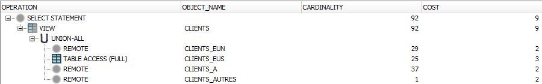

*Plan d’exécution non optimisé*

Pour cette requête, aucune optimisation n’est observable, la table CLIENTS_EuS présente en locale étant analysée dans son intégralité. Ici, cela ne pose pas vraiment de problèmes, tous les tuples formant la table CLIENTS devant être affichés, aucun doublon ne devrait être présent.

#### c) Analyse du plan d’exécution avec vue optimisée

Voici le plan d’exécution que nous avons obtenus avec l’utilisation d’une vue optimisée :

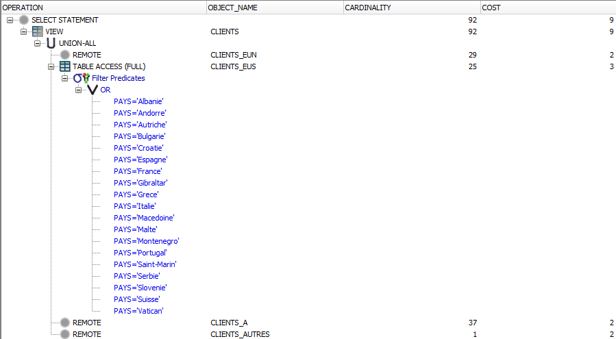

*Plan d’exécution optimisé*

Ici, à l’inverse, les prédicats ayant permis de créer la table CLIENTS_EuS en local sont réutilisés afin d’accélérer la requête. Cependant, aucune sélection n’étant effectuée, cette optimisation ne semble pas vraiment efficace, avec un coût constant avec ou sans l’utilisation de la vue optimisée.

### 2. Requête 2

Pour la 2ème requête, nous avons sélectionné tout des clients présents sur notre site, à partir d’une sélection sur leur pays, via la commande suivante :

SELECT *

FROM CLIENTS

WHERE PAYS IN (‘Italie’, ‘Portugal’, ‘Espagne’);

#### a) Résultat d’exécution

Voici le résultat de l’exécution de cette requête :

<table>
  <tr>
    <td>CODE_CLIENT</td>
    <td>SOCIETE</td>
    <td>ADRESSE</td>
    <td>VILLE</td>
    <td>CODE_POSTAL</td>
    <td>PAYS</td>
    <td>TELEPHONE</td>
    <td>FAX</td>
  </tr>
  <tr>
    <td>BOLID</td>
    <td>BÛlido Comidas preparadas</td>
    <td>Araquil, 67</td>
    <td>Madrid</td>
    <td>28023</td>
    <td>Espagne</td>
    <td>(91) 555 22 82</td>
    <td>(91) 555 91 99</td>
  </tr>
  <tr>
    <td>FISSA</td>
    <td>FISSA Fabrica Inter. Salchichas S.A.</td>
    <td>Moralzarzal, 86</td>
    <td>Madrid</td>
    <td>28034</td>
    <td>Espagne</td>
    <td>(91) 555 94 44</td>
    <td>(91) 555 55 93</td>
  </tr>
  <tr>
    <td>FRANS</td>
    <td>Franchi S.p.A.</td>
    <td>Via Monte Bianco 34</td>
    <td>Torino</td>
    <td>10100</td>
    <td>Italie</td>
    <td>011-4988260</td>
    <td>011-4988261</td>
  </tr>
  <tr>
    <td>FURIB</td>
    <td>Furia Bacalhau e Frutos do Mar</td>
    <td>Jardim das rosas n. 32</td>
    <td>Lisboa</td>
    <td>1675</td>
    <td>Portugal</td>
    <td>(1) 354-2534</td>
    <td>(1) 354-2535</td>
  </tr>
  <tr>
    <td>[...] 10 lignes sélectionnées</td>
    <td></td>
    <td></td>
    <td></td>
    <td></td>
    <td></td>
    <td></td>
    <td></td>
  </tr>
</table>

#### b) Analyse du plan d’exécution

Voici le plan d’exécution que nous avons obtenus avec l’utilisation d’une vue non optimisée :

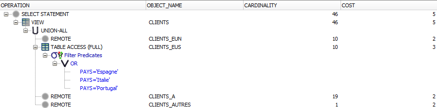

*Plan d’exécution non optimisé*

Nous voyons qu’il n’y a ici aucune optimisation, en effet, la table locale est accédée dans son ensemble lors de la sélection, avec une simple comparaison sur le PAYS. Par ailleurs, on peut également observer le fait que tous les autres fragments sont interrogés de la même manière, alors qu’aucun de leur tuple ne doit apparaître dans le résultat final.

#### c) Analyse du plan d’exécution avec vue optimisée

Voici le plan d’exécution que nous avons obtenus avec l’utilisation d’une vue optimisée :

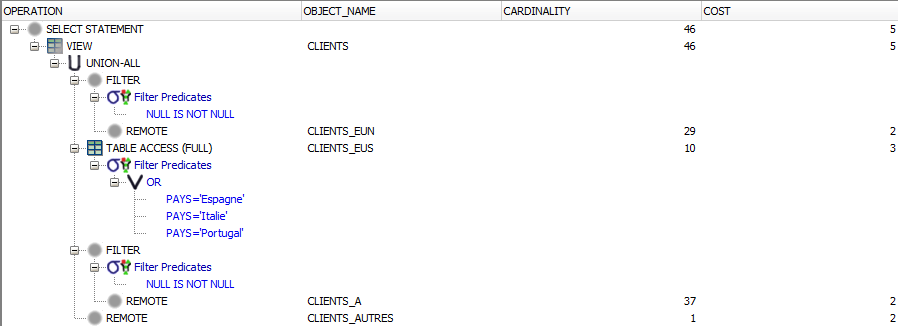

*Plan d’exécution optimisé*

Ici aussi, la table est parcourue dans son ensemble, avec le même coût estimé que précédemment.

De même, comme dans le cas précédent, les tuples hors zone sont aussi interrogés, ce qui est une perte de temps.

### 3. Requête 3

Pour la 3ème requête, nous avons sélectionné tout les clients présents sur notre site, à partir de notre table locale, via la commande suivante :

SELECT *

FROM CLIENTS_EuS;

#### a) Résultat d’exécution

Voici le résultat de l’exécution de cette requête :

<table>
  <tr>
    <td>CODE_CLIENT</td>
    <td>SOCIETE</td>
    <td>ADRESSE</td>
    <td>VILLE</td>
    <td>CODE_POSTAL</td>
    <td>PAYS</td>
    <td>TELEPHONE</td>
    <td>FAX</td>
  </tr>
  <tr>
    <td>BLONP</td>
    <td>Blondel pËre et fils</td>
    <td>24, place Kleber</td>
    <td>Strasbourg</td>
    <td>67000</td>
    <td>France</td>
    <td>03.88.60.15.31</td>
    <td>03.88.60.15.32</td>
  </tr>
  <tr>
    <td>BOLID</td>
    <td>BÛlido Comidas preparadas</td>
    <td>Araquil, 67</td>
    <td>Madrid</td>
    <td>28023</td>
    <td>Espagne</td>
    <td>(91) 555 22 82</td>
    <td>(91) 555 91 99</td>
  </tr>
  <tr>
    <td>BONAP</td>
    <td>Bon app'</td>
    <td>12, rue des Bouchers</td>
    <td>Marseille</td>
    <td>13008</td>
    <td>France</td>
    <td>04.91.24.45.40</td>
    <td>04.91.24.45.41</td>
  </tr>
  <tr>
    <td>CHOPS</td>
    <td>Chop-suey Chinese</td>
    <td>Hauptstr. 29</td>
    <td>Bern</td>
    <td>3012</td>
    <td>Suisse</td>
    <td>0452-076545</td>
    <td></td>
  </tr>
  <tr>
    <td>[...] 25 lignes sélectionnées</td>
    <td></td>
    <td></td>
    <td></td>
    <td></td>
    <td></td>
    <td></td>
    <td></td>
  </tr>
</table>

#### b) Analyse du plan d’exécution

Voici le plan d’exécution que nous avons obtenus avec l’utilisation d’une vue non optimisée :

*Plan d’exécution non optimisé*

Sans grande surprise, tous les tuples de la table concernée sont parcourus (avec probablement l’utilisation de l’index sur la clé primaire).

#### c) Analyse du plan d’exécution avec vue optimisée

Voici le plan d’exécution que nous avons obtenus avec l’utilisation d’une vue optimisée :

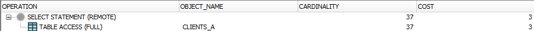

*Plan d’exécution optimisé*

L’exécution est clairement identique, la requête est suffisamment simple pour qu’on ne puisse pas s’attendre à un plan d'exécution différent de l’exécution "non optimisée".

### 4. Requête 4

Pour la 4ème requête, nous avons sélectionné des Clients présents dans plusieurs des sites, dont le nôtre, avec une sélection sur leur pays, via la commande suivante :

SELECT *

FROM CLIENTS

WHERE PAYS IN (‘France’, ‘Italie’, ‘Mexique’);

#### a) Résultat d’exécution

Voici le résultat de l’exécution de cette requête :

<table>
  <tr>
    <td>CODE_CLIENT</td>
    <td>SOCIETE</td>
    <td>ADRESSE</td>
    <td>VILLE</td>
    <td>CODE_POSTAL</td>
    <td>PAYS</td>
    <td>TELEPHONE</td>
    <td>FAX</td>
  </tr>
  <tr>
    <td>BLONP</td>
    <td>Blondel pËre et fils</td>
    <td>24, place Kleber</td>
    <td>Strasbourg</td>
    <td>67000</td>
    <td>France</td>
    <td>03.88.60.15.31</td>
    <td>03.88.60.15.32</td>
  </tr>
  <tr>
    <td>BONAP</td>
    <td>Bon app'</td>
    <td>12, rue des Bouchers</td>
    <td>Marseille</td>
    <td>13008</td>
    <td>France</td>
    <td>04.91.24.45.40</td>
    <td>04.91.24.45.41</td>
  </tr>
  <tr>
    <td>DUMON</td>
    <td>Du monde entier</td>
    <td>67, rue des Cinquante Otages</td>
    <td>Nantes</td>
    <td>44000</td>
    <td>France</td>
    <td>02.40.67.88.88</td>
    <td>02.40.67.89.89</td>
  </tr>
  <tr>
    <td>FOLIG</td>
    <td>Folies gourmandes</td>
    <td>184, chaussee de Tournai</td>
    <td>Lille</td>
    <td>59000</td>
    <td>France</td>
    <td>03.20.16.10.16</td>
    <td>03.20.16.10.17</td>
  </tr>
  <tr>
    <td>[...] 19 lignes sélectionnées</td>
    <td></td>
    <td></td>
    <td></td>
    <td></td>
    <td></td>
    <td></td>
    <td></td>
  </tr>
</table>

#### b) Analyse du plan d’exécution

Voici le plan d’exécution que nous avons obtenus avec l’utilisation d’une vue non optimisée :

*Plan d’exécution non optimisé*

Ici, on remarque que la table CLIENTS_EuS est interrogée sur l’intégralité de la requête effectuée, alors qu’elle ne contient que des tuples dont l’attribut PAYS correspond à la France et à l’Italie. Il en est de même pour les deux autres sites distants, montrant bien que la requête n’est pas optimisée.

#### c) Analyse du plan d’exécution avec vue optimisée

Voici le plan d’exécution que nous avons obtenus avec l’utilisation d’une vue optimisée :

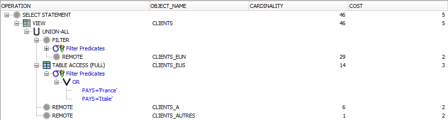

*Plan d’exécution optimisé*

A l’inverse, la table locale est ici consultée sur la correspondance de l’attribut PAYS avec la France et l’Italie, utilisant bien les prédicats définis lors de la création de la vue CLIENTS. Pour la table CLIENTS_EuN, aucun tuple ne doit être sélectionné, et on a bien le prédicat "NULL IS NOT NULL" indiquant qu’aucune sélection n’y est effectuée. La sélection est ainsi plus restrictive, et donc optimisée.

## B. Site Europe du Nord

### 1. Requête 1

SELECT * FROM CLIENTS;

#### a) résultat d’exécution

<table>
  <tr>
    <td>CODE_CLIENT </td>
    <td>SOCIETE </td>
    <td>ADRESSE </td>
    <td>VILLE </td>
    <td>CODE_POSTAL </td>
    <td>PAYS </td>
    <td>TELEPHONE </td>
    <td>FAX </td>
  </tr>
  <tr>
    <td>ANATR </td>
    <td>Ana Trujillo Emparedados y helados</td>
    <td>Avda. de la Constitucion 2222</td>
    <td>Mexico D.F.</td>
    <td>05021</td>
    <td>Mexique</td>
    <td>(5) 555-4729</td>
    <td>(5) 555-3745</td>
  </tr>
  <tr>
    <td>ANTON</td>
    <td>Antonio Moreno TaquerÌa</td>
    <td>Mataderos  2312</td>
    <td>Mexico D.F.</td>
    <td>05023</td>
    <td>Mexique</td>
    <td>(5) 555-3932</td>
    <td></td>
  </tr>
  <tr>
    <td>BOTTM</td>
    <td>Bottom-Dollar Markets</td>
    <td>23 Tsawassen Blvd.</td>
    <td>Tsawassen</td>
    <td>T2F 8M4</td>
    <td>Canada</td>
    <td>(604) 555-4729</td>
    <td>(604) 555-3745</td>
  </tr>
  <tr>
    <td>CACTU</td>
    <td>Cactus Comidas para llevar</td>
    <td>Cerrito 333</td>
    <td>Buenos Aires</td>
    <td>1010</td>
    <td>Argentine</td>
    <td>(1) 135-5555</td>
    <td>(1) 135-4892</td>
  </tr>
  <tr>
    <td>[...] 91 lignes sélectionnées</td>
    <td></td>
    <td></td>
    <td></td>
    <td></td>
    <td></td>
    <td></td>
    <td></td>
  </tr>
</table>

#### b) Analyse du plan d’exécution

Afin de reconstruire la vue CLIENTS (on veut toutes les lignes), la base de données doit interroger tous les fragments: aussi bien locaux que distants. C’est bien ce que montre le plan d’exécution.

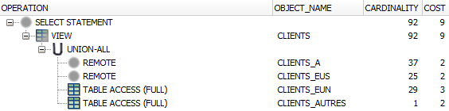

#### c) Analyse du plan d’exécution avec vue optimisée

Optimiser la vue en faisant apparaître les prédicat ne semble pas être utile pour cette requête car elle est indépendante du pays du client. La base de données interroge tous les fragments.

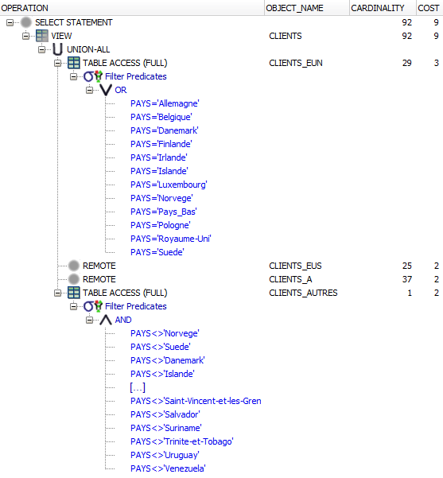

### 2. Requête 2

select * from clients where pays in ('Pologne', 'Finlande');

#### a) résultat d’exécution

<table>
  <tr>
    <td>CODE_CLIENT </td>
    <td>SOCIETE </td>
    <td>ADRESSE </td>
    <td>VILLE </td>
    <td>CODE_POSTAL </td>
    <td>PAYS </td>
    <td>TELEPHONE </td>
    <td>FAX </td>
  </tr>
  <tr>
    <td>WARTH</td>
    <td>Wartian Herkku</td>
    <td> Torikatu 38</td>
    <td>Oulu</td>
    <td>90110</td>
    <td>Finlande</td>
    <td>981-443655</td>
    <td>981-443655</td>
  </tr>
  <tr>
    <td>WILMK</td>
    <td>Wilman Kala</td>
    <td>Keskuskatu 45</td>
    <td>Helsinki</td>
    <td>21240</td>
    <td>Finlande</td>
    <td>90-224 8858</td>
    <td>90-224 8858</td>
  </tr>
  <tr>
    <td>WOLZA</td>
    <td>Wolski  Zajazd</td>
    <td>ul. Filtrowa 68</td>
    <td>Warszawa</td>
    <td>01-012</td>
    <td>Pologne</td>
    <td>(26) 642-7012</td>
    <td>(26) 642-7012</td>
  </tr>
  <tr>
    <td>3 lignes sélectionnées</td>
    <td></td>
    <td></td>
    <td></td>
    <td></td>
    <td></td>
    <td></td>
    <td></td>
  </tr>
</table>

#### b) Analyse du plan d’exécution

L’optimiseur n’arrive pas optimiser la requête distribuée: les fragments distants sont interrogés alors qu’ils ne sont pas nécessaires. (L’optimiseur n’a pas connaissance des prédicats.)

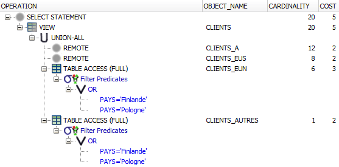

#### c) Analyse du plan d’exécution avec vue optimisée

Avec une vue CLIENTS qui fait apparaître les prédicats qui ont servis à définir les fragments, l’optimiseur est capable de repérer que certains fragments ne sont pas concernés par la requête. Les fragments distants CLIENTS_EUS et CLIENTS_A sont tout de même interrogés mais avec la requête "NULL IS NOT NULL" (qui n’a aucun effest).

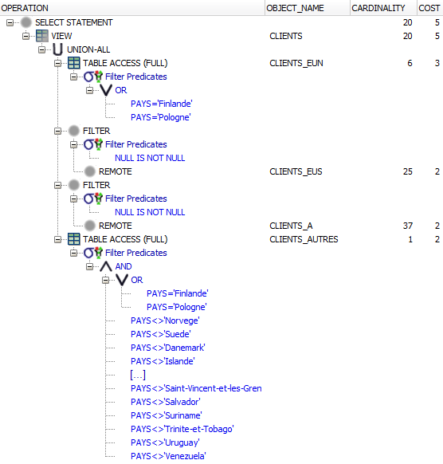

### 3. Requête 3

select * from clients_EuN;

#### a) résultat d’exécution

<table>
  <tr>
    <td>CODE_CLIENT </td>
    <td>SOCIETE </td>
    <td>ADRESSE </td>
    <td>VILLE </td>
    <td>CODE_POSTAL </td>
    <td>PAYS </td>
    <td>TELEPHONE </td>
    <td>FAX </td>
  </tr>
  <tr>
    <td>ALFKI</td>
    <td>Alfreds Futterkiste</td>
    <td>Obere Str. 57</td>
    <td>Berlin</td>
    <td>12209</td>
    <td>Allemagne</td>
    <td>030-0074321</td>
    <td>030-0076545</td>
  </tr>
  <tr>
    <td>AROUT</td>
    <td>Around the Horn</td>
    <td>120 Hanover Sq.</td>
    <td>London</td>
    <td>WA1 1DP</td>
    <td>Royaume-Uni</td>
    <td>(71) 555-7788</td>
    <td>(71) 555-6750</td>
  </tr>
  <tr>
    <td>BERGS</td>
    <td>Berglunds snabbkˆp</td>
    <td>Berguvsvegen  8</td>
    <td>Lulea</td>
    <td>S-958 22</td>
    <td>Suede</td>
    <td>0921-12 34 65</td>
    <td>0921-12 34 67</td>
  </tr>
  <tr>
    <td>BLAUS</td>
    <td>Blauer See Delikatessen</td>
    <td>Forsterstr. 57</td>
    <td>Mannheim</td>
    <td>68306</td>
    <td>Allemagne</td>
    <td>0621-08460</td>
    <td>0621-08924</td>
  </tr>
  <tr>
    <td>[...] 29 lignes sélectionnées</td>
    <td></td>
    <td></td>
    <td></td>
    <td></td>
    <td></td>
    <td></td>
    <td></td>
  </tr>
</table>

#### b) Analyse du plan d’exécution

Cette requête interroge directement la table locale CLIENTS_EUN. Il n’y a donc pas de requête sur le réseau.

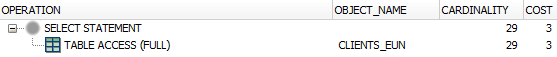

#### c) Analyse du plan d’exécution avec vue optimisée

L’optimisation de la vue client n’a pas d’effet sur cette requête (cette requête interroge directement le fragment local).

## C. Site Amérique

### 1. Requête 1

SELECT * FROM CLIENTS;

#### a) résultat d’exécution

<table>
  <tr>
    <td>CODE_CLIENT </td>
    <td>SOCIETE </td>
    <td>ADRESSE </td>
    <td>VILLE </td>
    <td>CODE_POSTAL </td>
    <td>PAYS </td>
    <td>TELEPHONE </td>
    <td>FAX </td>
  </tr>
  <tr>
    <td>ANATR </td>
    <td>Ana Trujillo Emparedados y helados</td>
    <td>Avda. de la Constitucion 2222</td>
    <td>Mexico D.F.</td>
    <td>05021</td>
    <td>Mexique</td>
    <td>(5) 555-4729</td>
    <td>(5) 555-3745</td>
  </tr>
  <tr>
    <td>ANTON</td>
    <td>Antonio Moreno TaquerÌa</td>
    <td>Mataderos  2312</td>
    <td>Mexico D.F.</td>
    <td>05023</td>
    <td>Mexique</td>
    <td>(5) 555-3932</td>
    <td></td>
  </tr>
  <tr>
    <td>BOTTM</td>
    <td>Bottom-Dollar Markets</td>
    <td>23 Tsawassen Blvd.</td>
    <td>Tsawassen</td>
    <td>T2F 8M4</td>
    <td>Canada</td>
    <td>(604) 555-4729</td>
    <td>(604) 555-3745</td>
  </tr>
  <tr>
    <td>CACTU</td>
    <td>Cactus Comidas para llevar</td>
    <td>Cerrito 333</td>
    <td>Buenos Aires</td>
    <td>1010</td>
    <td>Argentine</td>
    <td>(1) 135-5555</td>
    <td>(1) 135-4892</td>
  </tr>
  <tr>
    <td>[...] 91 lignes sélectionnées</td>
    <td></td>
    <td></td>
    <td></td>
    <td></td>
    <td></td>
    <td></td>
    <td></td>
  </tr>
</table>

#### b) Analyse du plan d’exécution

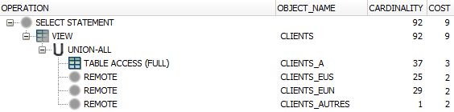

On voit ici que la requête a interrogé toutes les tables. On voit aussi qu’il n’y a pas eu d’optimisations, mais c’est normal pour une requête qui ne dépend pas des prédicats.

#### c) Analyse du plan d’exécution avec vue optimisée

TODO (image)

On voit ici qu’une sélection a été rajoutée sur CLIENTS_A. Dans ce cas-ci elle ne semble pas utile parce que toutes les tables sont interrogées de toute manière. (Il se peut même que rajouter ces tests par-dessus ralentisse légèrement les requêtes, mais à notre échelle c’est impossible à mesurer)

### 2. Requête 2

select * from clients where pays in ('Bolivie', 'Perou');

#### a) résultat d’exécution

<table>
  <tr>
    <td>CODE_CLIENT </td>
    <td>SOCIETE </td>
    <td>ADRESSE </td>
    <td>VILLE </td>
    <td>CODE_POSTAL </td>
    <td>PAYS </td>
    <td>TELEPHONE </td>
    <td>FAX </td>
  </tr>
  <tr>
    <td>WARTH</td>
    <td>Wartian Herkku</td>
    <td> Torikatu 38</td>
    <td>Oulu</td>
    <td>90110</td>
    <td>Finlande</td>
    <td>981-443655</td>
    <td>981-443655</td>
  </tr>
  <tr>
    <td>WILMK</td>
    <td>Wilman Kala</td>
    <td>Keskuskatu 45</td>
    <td>Helsinki</td>
    <td>21240</td>
    <td>Finlande</td>
    <td>90-224 8858</td>
    <td>90-224 8858</td>
  </tr>
  <tr>
    <td>WOLZA</td>
    <td>Wolski  Zajazd</td>
    <td>ul. Filtrowa 68</td>
    <td>Warszawa</td>
    <td>01-012</td>
    <td>Pologne</td>
    <td>(26) 642-7012</td>
    <td>(26) 642-7012</td>
  </tr>
  <tr>
    <td>3 lignes sélectionnées</td>
    <td></td>
    <td></td>
    <td></td>
    <td></td>
    <td></td>
    <td></td>
    <td></td>
  </tr>
</table>

#### b) Analyse du plan d’exécution

TODO: image

Cette requête pourrait être optimisée car elle ne concernce qu’un seul fragment (Clients_A) mais on voit sur le plan que tous les fragments ont été interrogés complètement (FULL ou remote sans "NULL IS NOT NULL"). La base de donnée ne sait pas que chaque fragment correspond à un prédicat (la vue se sert d’une table auxilliaire Pays_Continent), il faut donc optimiser la vue pour qu’elle tienne comptes des contraintes qui ont mené au partitionnement. (vue optimisée)

#### c) Analyse du plan d’exécution avec vue optimisée

Avec une vue Clients qui fait apparaître les prédicats qui ont servis à définir les fragments, l’optimiseur est capable de repérer que certains fragments ne sont pas concernés par la requête. En effet, pour Europe du Nord par exemple, la vue est défini avec WHERE pays = ‘Norvege’ OR pays = ‘Finlande’... Ainsi, l’optimiseur se rend compte qu’il y a incompatibilité entre ces conditions et la condition de la requête. Cela lui permet d’envoyer aux sites distants la requête ‘NULL IS NOT NULL’ a effectuer, ce qui prend moins de temps qu’un scan de toute la table.

TODO: image

### 3. Requête 3

select * from clients_A;

#### a) résultat d’exécution

<table>
  <tr>
    <td>CODE_CLIENT </td>
    <td>SOCIETE </td>
    <td>ADRESSE </td>
    <td>VILLE </td>
    <td>CODE_POSTAL </td>
    <td>PAYS </td>
    <td>TELEPHONE </td>
    <td>FAX </td>
  </tr>
  <tr>
    <td>ALFKI</td>
    <td>Alfreds Futterkiste</td>
    <td>Obere Str. 57</td>
    <td>Berlin</td>
    <td>12209</td>
    <td>Allemagne</td>
    <td>030-0074321</td>
    <td>030-0076545</td>
  </tr>
  <tr>
    <td>AROUT</td>
    <td>Around the Horn</td>
    <td>120 Hanover Sq.</td>
    <td>London</td>
    <td>WA1 1DP</td>
    <td>Royaume-Uni</td>
    <td>(71) 555-7788</td>
    <td>(71) 555-6750</td>
  </tr>
  <tr>
    <td>BERGS</td>
    <td>Berglunds snabbkˆp</td>
    <td>Berguvsvegen  8</td>
    <td>Lulea</td>
    <td>S-958 22</td>
    <td>Suede</td>
    <td>0921-12 34 65</td>
    <td>0921-12 34 67</td>
  </tr>
  <tr>
    <td>BLAUS</td>
    <td>Blauer See Delikatessen</td>
    <td>Forsterstr. 57</td>
    <td>Mannheim</td>
    <td>68306</td>
    <td>Allemagne</td>
    <td>0621-08460</td>
    <td>0621-08924</td>
  </tr>
  <tr>
    <td>[...] 29 lignes sélectionnées</td>
    <td></td>
    <td></td>
    <td></td>
    <td></td>
    <td></td>
    <td></td>
    <td></td>
  </tr>
</table>

#### b) Analyse du plan d’exécution

TODO: image

Cette requête n’interroge que la table locale Clients_A. Il n’y a donc aucune requête sur le réseau.

#### c) Analyse du plan d’exécution avec vue optimisée

L’optimisation de la vue client n’a pas d’effet sur cette requête, puisque cette requête interroge directement le fragment local sans passer par la vue.

# V. Réplications

## A. Mise en oeuvre des réplications sur le site Europe du Nord

### 1. Rappel binôme responsable

Le binôme responsable de ce site est le binôme B3226, composé de :

* SULTAN Arthur

* SAMBORSKI Charles

### 2. Objectifs

Pour des raisons d’optimisation, nous devions faire des réplications des tables Employes, Produits et Categories, présentes sur une base distante, et permettre aux autres sites de faire une réplication en REFRESH FAST de la table Fournisseurs. Ces réplications répondent à des besoins définis plus tôt, selon lesquelles chaque site a besoin de consulter la base dans son intégralité, comme si la base était centralisée. 

Par ailleurs, un moins un site devait être répliqué en REFRESH FAST, avec une modification partielle de la table lors de chaque mise à jour, et un en REFRESH COMPLETE, avec un rechargement complet de cette table à chaque mise à jour.

### 3. Liste des réplications prévues et analyse

Nous avons prévu :

* Une réplication de la table CATEGORIES, présente sur le site Europe du Sud, en REFRESH FAST, car on suppose que peu d’opérations sont effectuées sur cette table. De plus, la vue matérialisée crée sera en READ ONLY. En effet, le sujet indique que "C’est via l’application DesignIt et uniquement celle-ci qu’il est possible de modifier les catégories de produits ainsi que les produits vendus. Cette application n’est déployée que sur le site d’Europe du Sud.".

* Une réplication de la table PRODUITS, présente sur le site Europe du Sud, en REFRESH FAST, car on suppose que peu d’opérations sont effectuées sur cette table et que de nombreuses données peuplent sans doute cette table (rendant une réplication complète trop laborieuse).  Cette réplication sera réalisée en READ ONLY pour la même raison que CATEGORIES.

* Une réplication de la table Employes, présente sur le site Ameriques, en REFRESH COMPLETE, pour que de multiples actions sur cette table n’encombrent pas inutilement la bande passante. Par ailleurs, cette table n’étant pas très importante, son chargement intégral posera peu de problèmes. Cette réplication sera réalisée en READ ONLY, car le sujet précise que la gestion des employés n’est possible que depuis le site Ameriques.

Nous avons adopté une fréquence de rafraîchissement de  5 minutes pour chaque table , compromis adopté entre utilisation de la bande passante, et pertinence des données.

### 5. Mise en oeuvre des réplications pour les besoins locaux

#### a) Mise en place du réplicat du fragment EMPLOYES

##### (1) Opérations réalisées localement

Nous avons tout d’abord répliqué la table EMPLOYES, en REFRESH FAST, table présente dans le site Amerique. Un système de rafraîchissement toutes les 5 minutes a été adopté.

-- Réplication de la table EMPLOYES en REFRESH FAST

DROP MATERIALIZED VIEW MV_EMPLOYES;

CREATE MATERIALIZED VIEW MV_EMPLOYES

REFRESH FAST

NEXT sysdate + (300/86400)

AS

SELECT * FROM EMPLOYES;

##### (2) Message émis au site maître

Nous avons ainsi demandé au préalable à frobion (gestionnaire de la table EMPLOYES) de mettre en place un log sur cette table, et de nous donner les droits de sélection dessus afin de réaliser une réplication de cette table en mode FAST REFRESH.

##### (3) Réponse du site maître

Il a créé ce log et nous a accordé les droits de sélection dessus pour que nous puissions l’utiliser.

##### (4) Tests de vérification de bon fonctionnement de la réplication

Nous avons vérifié que chaque tuple présent dans la table Ryori était également présent dans la table répliquée, et inversement.

-- Test EMPLOYES 

SELECT COUNT(*)

FROM (

  (

    SELECT * FROM frobion.EMPLOYES@LINK_A

    MINUS

    SELECT * FROM EMPLOYES

  )

  UNION ALL

  (

    SELECT * FROM EMPLOYES

    MINUS

    SELECT * FROM frobion.EMPLOYES@LINK_A

  )

);

 

Réponse :

0

Conclusion : Les tuples sont présents à l’identique dans les deux tables.

Par ailleurs, le site Amérique a ajouté un tuple dans sa table locale EMPLOYES, et nous en avons effectivement observé l’ajout après rafraîchissement. Il en va de même pour la suppression du dit tuple (avec un rafraîchissement effectué toutes les 30 secondes de manière éphémère).

##### (5) Évolutions éventuelles des contraintes d’intégrité.

Les contraintes ayant déjà été mises en place, il n’y a pas eu besoin de les modifier.

##### (6) Évolutions éventuelles des vues et des synonymes.

Nous avons alors modifié le synonyme impliqué pour bénéficier de l’apport de cette vue matérialisée.

CREATE OR REPLACE SYNONYM EMPLOYES FOR MV_EMPLOYES;

#### b) Mise en place du réplicat du fragment CATEGORIES

##### (1) Opérations réalisées localement

Nous avons par la suite répliqué la table CATEGORIES, en REFRESH COMPLETE, table présente dans le site Europe du Sud.

-- Réplication de la table CATEGORIES en REFRESH COMPLETE

DROP MATERIALIZED VIEW MV_CATEGORIES;

CREATE MATERIALIZED VIEW MV_CATEGORIES

REFRESH COMPLETE

NEXT sysdate + (300/86400)

AS

SELECT * FROM CATEGORIES;

##### (2) Message émis au site maître

Les droits sur cette table nous ayant été accordés plus tôt, aucune synchronisation n’a été nécessaire pour créer ce réplicat.

##### (3) Tests de vérification de bon fonctionnement de la réplication

Nous avons vérifié que chaque tuple présent dans la table Ryori était également présent dans la table répliquée, et inversement.

-- Test CATEGORIES

SELECT COUNT(*)

FROM (

  (

    SELECT * FROM Ryori.CATEGORIES@LINK_EuN_R

    MINUS

    SELECT * FROM CATEGORIES

  )

  UNION ALL

  (

    SELECT * FROM CATEGORIES

    MINUS

    SELECT * FROM Ryori.CATEGORIES@LINK_EuN_R

  )

);

  

 

Réponse :

0

Conclusion : Les tuples sont présents à l’identique dans les deux tables.

Par ailleurs, le site Europe du Sud a ajouté un tuple dans sa table locale CATEGORIES, et nous en avons effectivement observé l’ajout après rafraîchissement. Il en va de même pour la suppression du dit tuple (avec un rafraîchissement effectué toutes les 30 secondes de manière éphémère).

##### (5) Évolutions éventuelles des contraintes d’intégrité.

Les contraintes ayant déjà été mises en place, il n’y a pas eu besoin de les modifier.

##### (6) Évolutions éventuelles des vues et des synonymes.

Nous avons alors modifié le synonyme impliqué pour bénéficier de l’apport de cette vue matérialisée.

CREATE OR REPLACE SYNONYM CATEGORIES FOR MV_CATEGORIES;

#### c) Mise en place du réplicat du fragment PRODUITS

##### (1) Opérations réalisées localement

Nous ensuite répliqué la table PRODUITS, en REFRESH FAST, table présente dans le site Europe du Sud. Un système de rafraîchissement toutes les 5 minutes a été adopté..

-- Réplication de la table PRODUITS en REFRESH FAST

DROP MATERIALIZED VIEW MV_PRODUITS;

CREATE MATERIALIZED VIEW MV_PRODUITS

REFRESH FAST

NEXT sysdate + (300/86400)

AS

SELECT * FROM PRODUITS;

##### (2) Message émis au site maître

Nous avons ainsi demandé au préalable à dbrunet (gestionnaire de la table PRODUITS) de mettre en place un log sur cette table, et de nous donner les droits de sélection dessus afin de réaliser une réplication de cette table en mode FAST REFRESH.

##### (3) Réponse du site maître

Il a créé ce log et nous a accordé les droits de sélection dessus pour que nous puissions l’utiliser.

##### (4) Tests de vérification de bon fonctionnement de la réplication

Nous avons vérifié que chaque tuple présent dans la table Ryori était également présent dans la table répliquée, et inversement.

-- Test PRODUITS

SELECT COUNT(*)

FROM (

  (

    SELECT * FROM Ryori.PRODUITS@LINK_EuN_R

    MINUS

    SELECT * FROM PRODUITS

  )

  UNION ALL

  (

    SELECT * FROM PRODUITS

    MINUS

    SELECT * FROM Ryori.PRODUITS@LINK_EuN_R

  )

);

 

Réponse :

0

Conclusion : Les tuples sont présents à l’identique dans les deux tables.

Par ailleurs, le site Amérique a ajouté un tuple dans sa table locale PRODUITS, et nous en avons effectivement observé l’ajout après rafraîchissement. Il en va de même pour la suppression du dit tuple (avec un rafraîchissement effectué toutes les 30 secondes de manière éphémère).

##### (5) Évolutions éventuelles des contraintes d’intégrité.

Les contraintes ayant déjà été mises en place, il n’y a pas eu besoin de les modifier.

##### (6) Évolutions éventuelles des vues et des synonymes.

Nous avons alors modifié le synonyme impliqué pour bénéficier de l’apport de cette vue matérialisée.

CREATE OR REPLACE SYNONYM PRODUITS FOR MV_PRODUITS;

### 6. Demandes d’autres sites portant sur des fragments gérés localement

#### a) Fragment FOURNISSEURS

##### (1) Demande des sites Europe du Sud et Amérique pour la table FOURNISSEURS

###### (a) Description de la demande et suivi

Les maîtres des sites Europe du Sud et Amérique (dbrunet et frobion) nous ont demandé de faire un log pour la table FOURNISSEURS, et de leur donner les droits de sélection sur ce dernier, cette table étant rafraîchie en mode REFRESH FAST pour les deux sites.

###### (b) Analyse de la demande

Cette table n’étant pas fragmentée, ils ont décidé d’en faire une réplication pour y avoir accès.

Ainsi, nous avons fait un LOG sur la table FOURNISSEURS, et nous leur avons donné les droits de sélection  appropriés à l’exploitation du log.

###### (c) Opérations réalisées en local

CREATE MATERIALIZED VIEW LOG ON FOURNISSEURS;

GRANT SELECT ON MLOG$_FOURNISSEURS TO FROBION;

GRANT ON MLOG$_FOURNISSEURS TO DBRUNET;

## B. Mise en oeuvre des réplications sur le site Europe du Sud

### 1. Rappel binôme responsable

Le binôme responsable de ce site est le binôme B3221, composé de :

* BRUNET Devon

* KIENLEN Nathan

### 2. Objectifs

Pour des raisons d’optimisation, nous devions faire des réplications des tables Employes, et Fournisseurs, présentes sur une base distante, et permettre aux autres sites de faire une réplication en REFRESH FAST de la table CATEGORIES. Ces réplications répondent à des besoins définis plus tôt, selon lesquels chaque site a besoin de consulter la base dans son intégralité, comme si la base était centralisée. 

Par ailleurs, un moins un site devait être répliqué en REFRESH FAST, avec une modification partielle de la table lors de chaque mise à jour, et un en REFRESH COMPLETE, avec un rechargement complet de cette table à chaque mise à jour.

### 3. Liste des réplications prévues

Nous avons prévu :

* Une réplication de la table EMPLOYES, présente sur le site Amerique, en REFRESH FAST, car on suppose que cette table change peu, avec des changements non significatifs. 

* Une réplication de la table FOURNISSEURS, présente sur le site Europe du Nord, en REFRESH COMPLETE, pour que de multiples actions sur cette table n’encombrent pas inutilement la bande passante. Par ailleurs, cette table n’étant pas très importante, son chargement intégral posera moins de problèmes que celle de la table EMPLOYES.

Ces réplications ont été mises en place avec une fréquence de rafraîchissement de 24h pour chaque table, compromis adopté entre utilisation de la bande passante, et accès aux données mises à jour.

### 4. Analyse.

Pour l’instant, comme nos tables sont relativement petites, une mise à jour tous les jours (pendant la nuit) ne posera aucun problème de bande passante. 

La base étant modifiée le moins régulièrement (EMPLOYES) a été répliquée en REFRESH FAST, et l’autre en REFRESH COMPLETE, afin de limiter au maximum le chargement de tuples total. 

Par ailleurs, les deux tables auraient pu être rechargées en REFRESH COMPLETE, n’étant pas modifiées régulièrement.

### 5. Mise en oeuvre des réplications pour les besoins locaux

#### a) Mise en place du réplicat du fragment EMPLOYES

##### (1) Opérations réalisées localement

Nous avons donc tout d’abord répliqué la table EMPLOYES, en REFRESH FAST, table présente dans le site Amérique. Un système de rafraîchissement journalier a été adopté.

-- Réplication de la table EMPLOYES en REFRESH FAST sur le site Europe du Sud

CREATE  MATERIALIZED VIEW MV_EMPLOYES

REFRESH FAST

NEXT SYSDATE + 1

AS

SELECT *

FROM frobion.EMPLOYES@LINK_A;

##### (2) Message émis au site maître

Nous avons ainsi demandé au préalable à frobion (gestionnaire de la table EMPLOYES) de mettre en place un log sur cette table, et de nous donner les droits de sélection dessus afin de réaliser une réplication de cette table en mode REFRESH FAST.

##### (3) Réponse du site maître

Il a créé ce log et nous a accordé les droits de sélection dessus pour que nous puissions l’utiliser.

##### (4) Tests de vérification de bon fonctionnement de la réplication

Nous avons vérifié que chaque tuple présent dans la table Ryori était également présent dans la table répliquée, et inversement. 

-- Test EMPLOYES 

SELECT COUNT(*)

FROM (

  (

    SELECT * FROM frobion.EMPLOYES@LINK_A

    MINUS

    SELECT * FROM EMPLOYES

  )

  UNION ALL

  (

    SELECT * FROM EMPLOYES

    MINUS

    SELECT * FROM frobion.EMPLOYES@LINK_A

  )

);

 

Réponse :

0

Conclusion : Les tuples sont présents à l’identique dans les deux tables.

Remarque : Ce test a été effectué après remplacement du synonyme EMPLOYES.

Par ailleurs, le site Amérique a ajouté un tuple dans sa table locale EMPLOYES, et nous en avons effectivement observé l’ajout après rafraichissement. Il en va de même pour la suppression dudit tuple (avec un rafraichissement effectué toutes les 30 secondes de manière éphémère).

##### (5) Évolutions éventuelles des contraintes d’intégrité.

Les contraintes ayant déjà été mises en place, il n’y a pas eu besoin de les modifier.

##### (6) Évolutions éventuelles des vues et des synonymes.

Nous avons alors modifié le synonyme impliqué pour bénéficier de l’apport de cette vue matérialisée.

CREATE OR REPLACE SYNONYM EMPLOYES FOR MV_EMPLOYES;

#### b) Mise en place du réplicat du fragment FOURNISSEURS

##### (1) Opérations réalisées localement

Nous avons par la suite répliqué la table FOURNISSEURS, en REFRESH COMPLETE, table présente dans le site Europe du Nord. Un système de rafraîchissement journalier à été adopté.

-- Réplication de la table FOURNISSEURS en REFRESH COMPLETE sur le site Europe du Sud

CREATE  MATERIALIZED VIEW MV_FOURNISSEURS

REFRESH COMPLETE

NEXT SYSDATE + 1

AS

SELECT *

FROM csamborski.FOURNISSEURS@LINK_EuN;

##### (2) Message émis au site maître

Les droits sur cette table nous ayant été accordés plus tôt, aucune synchronisation n’a été nécessaire pour créer ce réplicat.

##### (3) Tests de vérification de bon fonctionnement de la réplication

-- Test FOURNISSEURS

SELECT COUNT(*)

FROM (

  (

    SELECT * FROM csamborski.FOURNISSEURS@LINK_EuN

    MINUS

    SELECT * FROM FOURNISSEURS

  )

  UNION ALL

  (

    SELECT * FROM FOURNISSEURS

    MINUS

    SELECT * FROM csamborski.FOURNISSEURS@LINK_EuN

  )

);

Réponse :

0

Conclusion : Les tuples sont présents à l’identique dans les deux tables.

Remarque : Ce test a été effectué après remplacement du synonyme FOURNISSEURS.

Par ailleurs, le site Europe du Nord a ajouté un tuple dans sa table locale FOURNISSEURS, et nous en avons effectivement observé l’ajout après rafraichissement. Il en va de même pour la suppression dudit tuple (avec un rafraichissement effectué toutes les 30 secondes de manière éphémère).

##### (4) Évolutions éventuelles des contraintes d’intégrité.

Les contraintes ayant déjà été mises en place, il n’y a pas eu besoin de les modifier.

##### (5) Évolutions éventuelles des vues et des synonymes.

Nous avons alors modifié les synonymes impliqués pour bénéficier de l’apport des vues matérialisées.

CREATE OR REPLACE SYNONYM FOURNISSEURS FOR MV_FOURNISSEURS;

### 6. Demandes d’autres sites portant sur des fragments gérés localement

#### a) Fragment PRODUITS

##### (1) Demande des sites Europe du Nord et Amérique pour la table PRODUITS

###### (a) Description de la demande (Texte, Date, Personne…) et suivi

Les maîtres des sites Europe du Nord et Amérique (csamborski et frobion) nous ont demandé de faire un log pour la table PRODUITS, et de leur donner les droits de sélection sur ce dernier, cette table étant rafraîchie en mode REFRESH FAST pour les deux sites.

###### (b) Analyse de la demande

Cette table n’étant pas fragmentée, ils ont décidé d’en faire une réplication pour y avoir accès.

Ainsi, nous avons fait un LOG sur la table PRODUITS, et nous leur avons donné les droits de sélection  appropriés à l’exploitation du log.

De même, ces deux sites ont également répliqué la table CATEGORIES, mais en REFRESH COMPLETE cette fois, ce qui ne nous demande pas d’effectuer des opérations spécifiques.

###### (c) Opérations réalisées en local

CREATE MATERIALIZED VIEW LOG ON PRODUITS;

GRANT SELECT ON MLOG$_PRODUITS TO frobion;

GRANT SELECT ON MLOG$_PRODUITS TO csamborski;

## C. Mise en oeuvre des réplications sur le site Amérique

### 1 Rappel du binôme responsable

Le binôme responsable sur ce site est le binôme B3234, composé de:

* BLANC Alexandra (absente)

* ROBION François

### 2 Objectif

Cette réplication va servir à optimiser les requêtes faites sur les sites distant, y compris les requêtes utilisant les vues définies pour se rapprocher de la base centralisé de Ryori. De cette façon, ces requêtes ne seront plus envoyées aux sites distants, ce qui permettra de moins charger le réseaux, ainsi que de ne pas avoir à attendre la réponse de ces sites. Finalement, cela est aussi utile pour l’optimiseur, puisqu’il peut désormais accéder aux statistiques des tables répliquées.

### 3 Liste des réplications prévues

Sur le site Amérique, trois tables ont besoins d’être répliqué: 

* La table Fournisseurs, présente en Europe du Nord (REFRESH FAST)

* La table Produits, présente en Europe du Sud (REFRESH FAST)

* La table Catégories, présente en Europe du Sud (REFRESH COMPLETE)

### 4 Analyse

Il nous est demandé de faire au moins une réplication en REFRESH FAST, et une en REFRESH COMPLETE. Nous avons donc décidé de répliquer la table Catégories en REFRESH COMPLETE, et Fournisseurs et Produits en REFRESH FAST. En effet, REFRESH COMPLETE recopie toute la table, et catégories étant la plus petite des trois tables, cela permet de ne pas avoir à recopier beaucoup de tuples. Cependant, comme il y a probablement peu de changement dans cette table, un mode REFRESH FAST n’aurai quasiment aucun changement à faire et aurai pu être un bon choix également. Finalement, on considère qu’il y aura moins de changements sur Fournisseurs et Produits que de tuples dans ces bases, d’où le choix du REFRESH FAST.

Pour finir, nous avons décidé de rafraîchir ces tables tous les jours. Cela permet de garder les réplications à jour, tout en limitant la charge du réseau.

### 5 Mise en oeuvre des réplications pour les besoins locaux

#### a) Mise en place du réplicat de Fournisseurs

##### (1) Opérations réalisées localement

Nous avons répliqué la table Fournisseurs en REFRESH FAST, avec un rafraîchissement quotidien.

-- Réplication de la table Fournisseurs en REFRESH FAST sur le site d’amérique

CREATE MATERIALIZED VIEW MV_Fournisseurs

REFRESH FAST

NEXT sysdate + (86400/86400)

AS

SELECT *

FROM csamborski.Fournisseurs@link_A_EuN;

##### (2) Message émis au site maître

Nous avons demandé à csamborski, gestionnaire de la table Fournisseurs, de mettre en place un log sur cette table, et de nous donner les droits en séléction dessus, permettant ainsi cette réplication

##### (3) Tests de vérifications du bon fonctionnement de la réplication

Nous avons vérifier que la table répliqué localement et la table présente chez csamborski contenaient les mêmes tuples.

SELECT COUNT(*)

FROM (

  (

    SELECT * FROM csamborski.Fournisseurs@LINK_A_EuN

    MINUS

    SELECT * FROM MV_Fournisseurs

  )

  UNION ALL

  (

    SELECT * FROM MV_Fournisseurs

    MINUS

    SELECT * FROM csamborski.Fournisseurs@LINK_A_EuN)

);

Par ailleurs, nous avons également vérifier que lors de l’ajout ou de la suppression d’un tuple dans la table de Fournisseurs sur le site d’Europe du Sud, cette modification apparaît après le délai de rafraîchissement indiqué.

##### (4) Evolutions des vues et des synonymes

Le synonyme de Fournisseurs devient 

CREATE OR REPLACE SYNONYM Fournisseurs FOR MV_Fournisseurs;

En effet, ainsi il ne va plus chercher la table Fournisseurs distantes, mais bien la table locale.

#### b) Mise en place du réplicat Produits

Le réplicat Produits suit la même logique que Fournisseurs. Il faut juste penser à mettre le lien vers Europe du Nord et non Europe du Sud.

#### c) Mise en place du réplicat Catégories

##### (1) Opérations réalisées localement

Nous avons ensuite créer le réplicat Catégories en REFRESH COMPLETE.

CREATE MATERIALIZED VIEW MV_Categories

REFRESH COMPLETE

NEXT sysdate + (86400/86400)

AS

SELECT *

FROM Categories;

##### (2) Message émis au site maître

Lors d’une réplication complète, le système recopie toute la table du site maître vers le site locale. Comme nous avons déjà eu les droits en sélection sur la table du site maître, aucun changement n’a été nécessaire.

##### (3) Tests de vérification du bon fonctionnement de la réplication

SELECT COUNT(*)

FROM (

  (

    SELECT * FROM dbrunet.Categories@LINK_A_EuS

    MINUS

    SELECT * FROM MV_Categories

  )

  UNION ALL

  (

    SELECT * FROM MV_Categories

    MINUS

    SELECT * FROM dbrunet.Categories@LINK_A_EuS)

);

##### (4) Evolution des synonymes

La définition du synonyme de la table Categories devient

CREATE OR REPLACE SYNONYM Categories FOR MV_Categories;

### 6 Demandes d’autres sites portant sur des fragments gérés localement

#### a) Table Employes

##### (1) Demande des sites Europe du Nord et Europe du Sud

###### (a)  Description de la demande

Les responsables des sites d’Europe du Nord et d’Europe du Sud nous ont demandé de faire un log de la table employés pour qu’il puisse faire des réplicat en REFRESH FAST.

###### (b) Analyse de la demande

Cette table n’était en effet pas fragmenté, et ils voulaient, pour des raisons d’optimisation, la répliquer chez eux. Puisqu’ils avaient choisi le mode REFRESH FAST, ils ont eu besoin d’un log de cette table, avec les droits en sélection dessus.

###### (c) Opérations réalisées en local

DROP MATERIALIZED VIEW LOG ON Employes;

CREATE MATERIALIZED VIEW LOG ON Employes;

GRANT SELECT ON MLOG$_Employes TO csamborski, dbrunet;

## D. Bilan global des réplications mises en oeuvre sur les différents sites.

Voici le tableau récapitulant l’ensemble des réplicats mis en places sur les trois sites permettant la mise en place de la base en mode distribué :

<table>
  <tr>
    <td>Tables\Sites</td>
    <td>Europe du Nord</td>
    <td>Europe du Sud</td>
    <td>Amérique</td>
  </tr>
  <tr>
    <td>EMPLOYES</td>
    <td>REFRESH FAST</td>
    <td>REFRESH FAST</td>
    <td>X</td>
  </tr>
  <tr>
    <td>CATEGORIES</td>
    <td>REFRESH COMPLETE</td>
    <td>X</td>
    <td>REFRESH COMPLETE</td>
  </tr>
  <tr>
    <td>PRODUITS</td>
    <td>REFRESH FAST</td>
    <td>X</td>
    <td>REFRESH FAST</td>
  </tr>
  <tr>
    <td>FOURNISSEURS</td>
    <td>X</td>
    <td>REFRESH COMPLETE</td>
    <td>REFRESH FAST</td>
  </tr>
</table>

Ainsi, le mode de rafraîchissement REFRESH FAST a été généralement préféré au mode REFRESH COMPLETE, les tables manipulées n’étant pas modifiées de manière vraiment fréquentes. Ainsi, ce sont les tables non conséquentes qui ont été répliquées en REFRESH COMPLETE, afin d’éviter une trop grande utilisation de la bande passante lors des mises à jour. Celles-ci sont journalières, permettant une certaine cohérence entre les réplicats et les sites maîtres, sans occuper de manière trop importante la bande passante.

# VI. Requêtes distribuées : tests et optimisations

## A. Site Europe du Sud

Nous avons enfin exécuté quelques requêtes permettant d’observer l’action des réplicats et de la fragmentation de la base centralisée sur les plans d’optimisation observés.

### 1. Requête 1

Pour la 1ère requête, nous avons effectué une jointure entre la base EMPLOYES, d’abord non répliquée, avec la table COMMANDES, générée par une vue optimisée, via la commande suivante :

SELECT *

FROM EMPLOYES, COMMANDES

WHERE EMPLOYES.NO_EMPLOYE=COMMANDES.NO_EMPLOYE;

#### a) Résultat d’exécution

Voici le résultat de l’exécution de cette requête :

<table>
  <tr>
    <td></td>
    <td></td>
    <td></td>
    <td></td>
    <td></td>
    <td></td>
    <td></td>
    <td></td>
  </tr>
  <tr>
    <td></td>
    <td></td>
    <td></td>
    <td></td>
    <td></td>
    <td></td>
    <td></td>
    <td></td>
  </tr>
  <tr>
    <td></td>
    <td></td>
    <td></td>
    <td></td>
    <td></td>
    <td></td>
    <td></td>
    <td></td>
  </tr>
  <tr>
    <td></td>
    <td></td>
    <td></td>
    <td></td>
    <td></td>
    <td></td>
    <td></td>
    <td></td>
  </tr>
  <tr>
    <td></td>
    <td></td>
    <td></td>
    <td></td>
    <td></td>
    <td></td>
    <td></td>
    <td></td>
  </tr>
  <tr>
    <td></td>
    <td></td>
    <td></td>
    <td></td>
    <td></td>
    <td></td>
    <td></td>
    <td></td>
  </tr>
</table>

#### b) Analyse du plan d’exécution

Voici le plan d’exécution que nous avons obtenus avec l’utilisation d’une vue non optimisée (réplicat non implémenté) :

#### 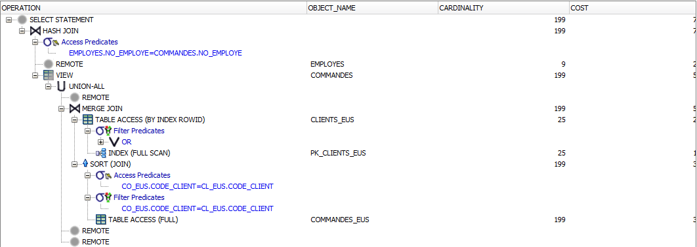

#### *Plan d’exécution non optimisé*

Ici, on se rend bien compte que la table EMPLOYES, venant d’un site externe, empêche l’utilisation d’une jointure exploitant son index. Par ailleurs, la sélection est effectuée en amont, le site local ne pouvant optimiser la requête sans connaître la taille de la table EMPLOYES externe, entre autres.

#### c) Analyse du plan d’exécution avec vue optimisée

Voici le plan d’exécution que nous avons obtenus avec l’utilisation d’une vue optimisée (réplicat implémenté) :

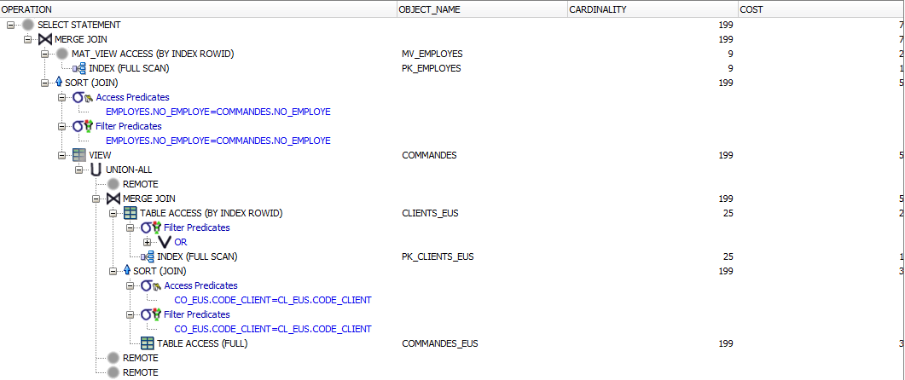

*Plan d’exécution optimisé*

Lorsque la table EMPLOYES est répliquée, on se rend compte que l’optimiseur trouve un plan d’exécution plus efficace, avec une jointure utilisant la clé primaire de la table EMPLOYES et une sélection effectuée sur la table COMMANDES. Cette sélection ne cassant pas d’index utile et permettant un tri de cette table, et étant réalisable grâce à ce réplicat, on se rend compte de son importance et de l’action de l’optimiseur sur cette requête.

2) Autres idées de requêtes ?

## B. Site Europe du Nord

On vérifie que notre trigger qui implémente la contrainte de clé étrangère sur STOCK_EUN rejette bien les requêtes si la clé n’existe pas. (Ici la clé 14007).

-- TRIGGERS

-- FK STOCK_EUN

INSERT INTO STOCK_EUN Values(14007, 'Allemagne', 15, 8, 0);

## C. Site Amérique

